# Java语言

## HelloWorld

~~~java
public class HelloWorld {
    public static void main(String[] args) {
        System.out.println("hello word");
    }
}
~~~

快捷键：

- psum
- sout

其中public是访问修饰符

## 注释

1. 单行注释：

   ~~~java
   //单行注释
   ~~~

2. 多行注释：

   ~~~java
   /*
   多行注释
   */
   ~~~

## 标识符

由字母，数字，下划线（_）和美元符号（$）组成，但标识符**不能以数字开头**，**不能是Java中的关键字**

## 关键字

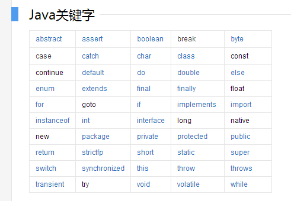

| 关键字           | 含义                                                         | 使用方法                                                     |
| ---------------- | ------------------------------------------------------------ | ------------------------------------------------------------ |
| **abstract**     | 表明类或者成员方法具有抽象属性                               |                                                              |
| assert           | 断言                                                         | 用来进行程序调试                                             |
| boolean          | 基本数据类型之一，布尔类型                                   |                                                              |
| break            | 提前跳出一个块                                               |                                                              |
| byte             | 基本数据类型之一，字节类型                                   |                                                              |
| case             |                                                              | 用在 switch 语句中，表示其中一个分支                         |
| catch            |                                                              | 用在异常处理中，用来捕捉异常                                 |
| char             | 基本数据类型之一，字符类型                                   |                                                              |
| class            | 类                                                           |                                                              |
| const            | 保留关键字，没有具体含义                                     |                                                              |
| continue         |                                                              | 回到一个块的开始处                                           |
| default          | 默认                                                         | 例如，用在 switch 语句中，表明一个默认的分支                 |
| do               |                                                              | 用在 do-while 循环结构中                                     |
| double           | 基本数据类型之一，双精度浮点数类型                           |                                                              |
| else             |                                                              | 用在条件语句中，表明当条件不成立时的分支                     |
| enum             | 枚举                                                         |                                                              |
| extends          | 表明一个类型是另一个类型的子类型，这里常见的类型有类和接口   |                                                              |
| **final**        | 用来说明最终属性，表明一个类不能派生出子类，或者成员方法不能被覆盖，或者成员域的值不能被改变，用来定义常量 |                                                              |
| finally          |                                                              | 用于处理异常情况，用来声明一个基本肯定会被执行到的语句块     |
| float            | 基本数据类型之一，单精度浮点数类型                           |                                                              |
| for              |                                                              | 一种循环结构的引导词                                         |
| goto             |                                                              | 保留关键字，没有具体含义                                     |
| if               |                                                              | 条件语句的引导词                                             |
| implements       | 表明一个类实现了给定的接口                                   |                                                              |
| import           | 表明要访问指定的类或包                                       |                                                              |
| instanceof       |                                                              | 用来测试一个对象是否是指定类型的实例对象                     |
| int              | 基本数据类型之一，整数类型                                   |                                                              |
| interface        | 接口                                                         |                                                              |
| long             | 基本数据类型之一，长整数类型                                 |                                                              |
| native           |                                                              | 用来声明一个方法是由与计算机相关的语言（如 C/C++/FORTRAN 语言）实现的 |
| new              |                                                              | 用来创建新实例对象                                           |
| package          | 包                                                           |                                                              |
| private          | 一种访问控制方式：私用模式                                   |                                                              |
| protected        | 一种访问控制方式：保护模式                                   |                                                              |
| public           | 一种访问控制方式：共用模式                                   |                                                              |
| return           |                                                              | 从成员方法中返回数据                                         |
| short            | 基本数据类型之一，短整数类型                                 |                                                              |
| **static**       | 表明具有静态属性                                             |                                                              |
| strictfp         |                                                              | 用来声明 FP_strict（单精度或双精度浮点数）表达式遵循 IEEE 754 算术规范 |
| super            | 表明当前对象的父类型的引用或者父类型的构造方法               |                                                              |
| switch           |                                                              | 分支语句结构的引导词                                         |
| **synchronized** |                                                              | 表明一段代码需要同步执行                                     |
| this             |                                                              | 指向当前实例对象的引用                                       |
| throw            |                                                              | 抛出一个异常                                                 |
| throws           |                                                              | 声明在当前定义的成员方法中所有需要抛出的异常                 |
| transient        |                                                              | 声明不用序列化的成员域                                       |
| try              |                                                              | 尝试一个可能抛出异常的程序块                                 |
| void             |                                                              | 声明当前成员方法没有返回值                                   |
| **volatile**     |                                                              | 表明两个或者多个变量必须同步地发生变化                       |
| while            |                                                              | 用在循环结构中                                               |

## 重点 Java 关键字详细介绍

### final

#### final 关键字在 Java 中有什么作用？

final 可用于修饰类、类属性和类方法。

特征：凡是引用 final 关键字的地方皆不可修改！

- 修饰类：表示该类不能被继承。
- 修饰变量：表示变量只能一次赋值之后值不能被修改（常量）。
- 修饰方法：表示方法不能被重写。

#### final 有哪些用法？

这个问题很多面试官都喜欢问，虽然无聊但确实能让人懵逼一下。

- 被 final 修饰的类不能被继承。
- 被 final修饰的常量，在编译阶段会存入常量池内。
- 被 final 修饰的变量不能被改变。如果修饰引用，那么表示引用不可变，引用指向的内容可变。
- 被 final 修饰的方法不能被重写。
- 被 final 修饰的方法，JVM 会尝试将其内联，以提高运行效率。

除此之外，编译器对 final 域要遵守的两个重排序规则更好：

- 在构造函数内对一个 final 域的写入，与随后把这个被构造对象的引用赋值给一个引用变量，这两个操作之间不能重排序。
- 初次读一个包含 final 域的对象的引用，与随后初次读这个 final 域，这两个操作之间不能重排序。

### static

#### static 有哪些用法？

大家都知道 static 关键字两个基本的用法：静态变量和静态方法。也就是说，被 static 所修饰的变量/方法都属于类的静态资源，类实例所共享。

除了静态变量和静态方法之外，static 也用于静态块，多用于初始化操作：

~~~java
public class PreCache {
    static {
        // 执行相关操作
    }
}
~~~

此外 static 也多用于修饰内部类，此时称之为静态内部类。

最后一种用法就是静态导包，即 `import static`。import static 是在 JDK1.5 之后引入的新特性，可以用来指定导入某个类中的静态资源，并且不需要使用类名，可以直接使用资源名，例如：

~~~java
import static java.lang.Math.*;

public class Test {
    public static void main(String[] args) {
        // System.out.println(Math.sin(20)); 传统做法
        System.out.println(sin(20));
    }
}
~~~

------


### static 和 final 的区别

| 修饰物 | 关键词 | 影响                                                     |
| ------ | ------ | -------------------------------------------------------- |
| 变量   | final  | 分配到常量池中，程序不可改变其值                         |
| 变量   | static | 分配在内存堆上，引用都会指向这一个地址而不会重新分配内存 |
| 方法   | final  | 子类中将不能被重写                                       |
| 方法块 | static | 虚拟机优先加载                                           |
| 类     | final  | 不能被继承                                               |
| 类     | static | 可以直接通过类来调用而不需要 new                         |

------


## Java的常量

关键字final可以指示常量：
~~~java
final double NUM=0.1;
~~~

默认常量全大写。**注意`final`一旦赋值不可更改！！！**

在Java中可能经常需要创建一个常量以便在一个类的多个方法使用，通常成为**`类常量`**。用关键**`static final`**来进行设置：

~~~java
public class HelloWorld {
    public static final double STEP=0.1;
    public static void main(String[] args) {
    }
    }
~~~

------


### 整型常量

整数类型的数据：二进制，八进制，十进制和十六进制。

- 二进制：由0和1组成的数字序列。从**JDK7**开始允许字面表示二进制，但之前要用0b或者0B表示二进制例如0b01101100等
- 八进制：以**0开头**并且其后是由0~7的整数组成的数字序列，如0342。
- 十进制：由数字0~9的整数组成的数字序列，例如198。
- 十六进制：以0x或者0X开头并且其后由0~9，A~F（字母不区分大小写）组成的数字序列，例如：0x25AF。

------


### 浮点数常量

Java中的浮点数分为单精度浮点数（float）和双精度浮点数（double）在Java中默认为**双精度**。

- 单精度浮点数后面以**F或f**结尾
- 双精度浮点数后面以**D或d**结尾
- 不加任何后缀默认双精度！！

例子：2e3f，2.7d

------


### 字符常量

字符常量只可以用于表示一个字符，并且要用**''**(英语的单引号扩起来)。

字符常量可为：

- 英文字母：'a'
- 数字：'1'
- 标点符号：'&'
- 转义序列表示的特殊字符：'\r','\u0000'

------


### 字符串常量

字符串常量可以是一个或者多个字符也可以为0个字符，要用**""**(英语的双括号扩起来)。

例子如下：
"helloword","123","Welcom \n XXX",""

------


### Java 中 `String` 与 `char` 的区别

**注：两者不可以直接比较**

| 特性             | `String`（字符串）                         | `char`（字符）                             |
| ---------------- | ------------------------------------------ | ------------------------------------------ |
| **定义方式**     | 用 **双引号**，如 `"A"`、`"hello"`         | 用 **单引号**，如 `'A'`、`'中'`            |
| **数据类型**     | 引用类型（对象，`java.lang.String`）       | 基本数据类型（16位 Unicode 编码）          |
| **长度**         | 可以包含多个字符                           | 只能存一个字符                             |
| **存储方式**     | 存在 **字符串常量池/堆**，不可变对象       | 存在 **栈或堆中**（基本类型变量）          |
| **比较方式**     | 用 `.equals()` 比较内容，`==` 比较引用地址 | 用 `==` 直接比较字符值                     |
| **能否直接比较** | 不能和 `char` 直接比较                     | 不能和 `String` 直接比较                   |
| **转换方法**     | `s.charAt(0)` 可取出第一个 `char`          | `String.valueOf(c)` 可把 `char` 转为字符串 |

例子：
~~~ java
String s = "A"; 
char c = 'A';

// 方法一：char 转 String
System.out.println(s.equals(String.valueOf(c))); // true

// 方法二：取 String 的第一个字符
System.out.println(s.charAt(0) == c); // true

~~~

------


### 布尔常量

有且只有true和false两个值。

------


### null常量

只有一个值null，表示对象的引用为空。

------


## Java中的变量

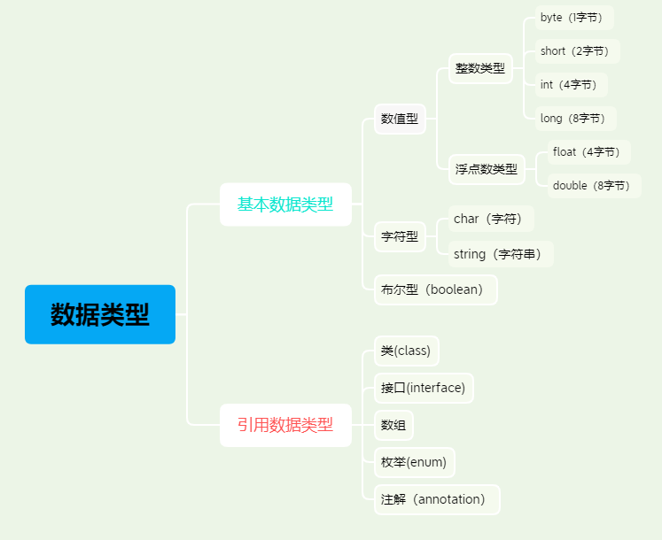

声明变量：
先指定变量的类型，再指定变量名。
变量名的标识符由字母，数字，货币符号以及"标点链接线"组成。第一个字符不能为数字！

------


### 整数类型变量

| 类型  | 占用的存储空间 |                       取值范围                        |
| :---: | :------------: | :---------------------------------------------------: |
| byte  |  8位（1字节）  |           **-2⁷ ~ 2⁷ - 1**  （-128 ~ 127）            |
| short | 16位（2字节）  |        **-2¹⁵ ~ 2¹⁵ - 1** （-32,768 ~ 32,767）        |
|  int  | 32位（4字节）  | **-2³¹ ~ 2³¹ - 1** （-2,147,483,648 ~ 2,147,483,647） |
| long  | 64位（8字节）  |   **-2⁶³ ~ 2⁶³ - 1** （约 -9.22×10¹⁸ ~ 9.22×10¹⁸）    |

  注意：long类型的变量赋值时，值后面要加L（或小写l）说明赋值为long类型。如果赋值大小未超过int类型则可以省略。

------


### 浮点类型变量

| 类型     | 占用的存储空间  | 精度（有效位）      | 取值范围（约）            | 指数范围（2 的次方表示） |
| -------- | --------------- | ------------------- | ------------------------- | ------------------------ |
| `float`  | 4 字节（32 位） | 约 6~7 位有效数字   | ±3.4028235×10³⁸           | 2⁻¹²⁶ ~ 2¹²⁷             |
| `double` | 8 字节（64 位） | 约 15~16 位有效数字 | ±1.7976931348623157×10³⁰⁸ | 2⁻¹⁰²² ~ 2¹⁰²³           |

正常情况下整数类型不可以除以0，但当0为浮点类型时就可以了，结果为±Infinity（正负无穷）。0.0/0.0的结果为NaN！
~~~java
public class HelloWorld {
    public static void main(String[] args) {
        double a = 0.0;
        System.out.println(1.0 / a);    // Infinity
        System.out.println(-1.0 / a);   // -Infinity
        System.out.println(0.0 / a);    // NaN
    }

}
~~~

有三个特殊的浮点数值表示溢出和出错情况：

- 正无穷
- 负无穷
- NaN（不是一个数）

~~~java
double posInf = Double.POSITIVE_INFINITY; // +∞
double negInf = Double.NEGATIVE_INFINITY; // -∞
double n = Double.NaN;//NaN
~~~

特别说明：
NaN不能用以下方法检测：
if（x==Double.NaN）
所有NaN值都认为不是相同的。可以使用Double.isNaN方法来判断：
if（Double.isNaN（x））

------


### 字符型变量

------

#### 一、基本定义

在 Java 中，**字符类型** 用关键字 `char` 定义。
 它表示单个 **Unicode 字符**（而不是 ASCII），
 可以存储任意语言的文字、符号或数字。

```java
char c = 'A';
char ch = '中';
```

------

#### 二、存储特性

| 特性         | 说明                                 |
| ------------ | ------------------------------------ |
| **类型名**   | `char`                               |
| **占用空间** | 2 字节（16 位）                      |
| **编码标准** | Unicode（不是 ASCII）                |
| **取值范围** | 0 ~ 65,535（即 `\u0000` ~ `\uFFFF`） |
| **属于**     | 基本数据类型                         |

> Java 规定 `char` 是 **无符号数**，没有负号（和 C 语言不同）。

------

#### 三、几种常见赋值方式

```java
char a = 'A';       // 直接用字符
char b = 65;        // 用整数（对应 Unicode 编码 65 -> 'A'）
char c = '\u0041';  // 用 Unicode 转义序列（0041 = 65）
char d = '中';      // 存中文字符
```

它们输出的结果都是：

```java
System.out.println(a); // A
System.out.println(b); // A
System.out.println(c); // A
System.out.println(d); // 中
```

------

#### 四、char 实际上是一个无符号整数

你可以对它进行运算：

```java
char ch = 'A';
System.out.println((int) ch); // 输出 65

char next = (char)(ch + 1);
System.out.println(next); // 输出 B
```

------

####  五、常见转义字符

| 写法       | 含义              | Unicode             |
| ---------- | ----------------- | ------------------- |
| `'\n'`     | 换行              | `\u000A`            |
| `'\t'`     | 制表符（Tab）     | `\u0009`            |
| `'\\'`     | 反斜杠            | `\u005C`            |
| `'\'`'`    | 单引号            | `\u0027`            |
| `'\"'`     | 双引号            | `\u0022`            |
| `'\uXXXX'` | 任意 Unicode 字符 | 例：`\u4E2D` → “中” |

------

####  六、小结

| 特性       | 说明                       |
| ---------- | -------------------------- |
| 数据类型   | `char`                     |
| 占用空间   | 2 字节（16 位）            |
| 范围       | 0 ~ 65535                  |
| 编码标准   | Unicode                    |
| 是否有符号 | 无符号                     |
| 示例       | `'A'`、`'中'`、`'\u4E2D'`  |
| 可用于运算 | ✅ 可以加减（会自动转 int） |

------

### 布尔值变量

有且只有true和false两个值。

------


## 枚举类型

一个变量只包含有限的一组值。例如：季节只包含春夏秋冬。
这是可以运用`自定义枚举类型`。

~~~java
public class HelloWorld {
    public static void main(String[] args) {
        Season s = Season.SPRING;
        System.out.println(s);
    }

}
enum Season{
    SPRING, SUMMER, AUTUMN, WINTER
}
~~~

------


## 运算符

### 算术运算符

通常的算术运算符为：+，-，*,/,%分别为加，减，乘，除，取模。
注意：这里的除只为整数除法，要有**小数点的是为浮点除法**。

------


### 数学函数与常量

举一些例子：
求一个数的平方根，运用**`sqrt`**方法

~~~java
double x = 4;
double y = Math.sqrt(x);
System.out.println(y);//输出为2
~~~

求一个数的几次方，运用**`pow`**方法
~~~java
double y = 2;
double z = 4;
double f = Math.pow(y,z);
System.out.println(f);
~~~

注意参数全为浮点型。

一些常用的三角函数：
Math.sin
Math.cos
Math.tan
Math.atan
Math.atan2
指数函数，反函数，自然对数和以10为底的对数：
Math.exp
Math.log
Math.log10
Π与e常量最接近的近似值：
Math.PI
Math.E

### 数值类型之间转换

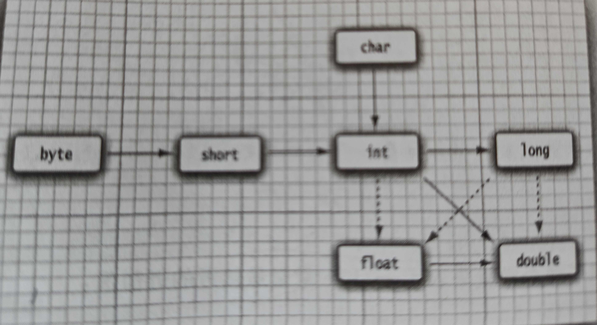

6条实线箭头为无信息丢失的转换；3个虚线箭头表示可能有精度的丢失。

当二元运算符连接两个值时（例如n+f，n为整数，f为浮点数）先要将两个操作数转换为同一种类型，然后再进行计算。

- 当两个操作数有一个为double型，另一个操作数会转换为double类型
- 否则，当两个操作数有一个为float型，另一个操作数会转换为float类型
- 否则，当两个操作数有一个为long型，另一个操作数会转换为long类型
- 否则，两个操作数都会转换为int类型

| 情况                   | 示例           | 转换结果类型 |
| ---------------------- | -------------- | ------------ |
| 有 `double`            | `int + double` | `double`     |
| 无 `double` 有 `float` | `int + float`  | `float`      |
| 无 `float` 有 `long`   | `int + long`   | `long`       |
| 其他整数类型           | `byte + short` | `int`        |

------


### 强制类型转换

正常情况下int类型会自动转换为double类型，但也可以通过强制转换将double转换为int

例如：
~~~java
double x = 8.88;
int nx = (int) x;//nx的值为8
~~~

这种强制转换是通过截断小数部分来将浮点型转换为整型。

还要一种舍入的强制转换，通过Math.round方法来实现。
~~~java
double x = 8.88;
int nx = (int) Math.round(x);//nx结果为9
~~~

### 赋值

如果x 为int类型则：
x +=4.6;
就会发生强制类型转换，强制转换为int型。

------


### 自增与自减运算符

前缀形式会先完成加1或减一，而后缀会先运算再赋值加减1。

------


### 关系和boolean运算符

检测相等性可以用==。
&&逻辑“与”运算符，当第一个值为false那么结果直接为false。

||逻辑“非”运算符，当第一个值为true那么结果直接为true。

------


### 条件运算符

x  < y ? x : y;

会返回x与y中比较小的一个

------


### switch表达式

传统写法需要**`break`**
~~~java
switch (seasonCode) {
    case 0:
        seasonName = "Spring";
        break;
    ...
}
~~~

现在直接用：
~~~java
case 0 -> "Spring";
~~~

| 对比项     | 旧版 switch         | 新版 switch（表达式） |
| ---------- | ------------------- | --------------------- |
| 语法       | 使用 `:` 和 `break` | 使用 `->`             |
| 是否返回值 | 否                  | ✅ 可以直接返回值      |
| 是否易读   | 一般                | ✅ 更简洁、更安全      |
| 可用于赋值 | ❌                   | ✅ 直接赋值            |

完整代码：
~~~java
public class HelloWorld {
    public static void main(String[] args) {
        int seasonCode=2;
        String seasonName = switch (seasonCode){
            case 0 -> "Spring";
            case 1 -> "Summer";
            case 2 -> "Fall";
            case 3 -> "Winter";
            default -> "???";
        };
        System.out.println("Season:"+seasonName);//Season:Fall
    }
}
~~~

可以为case提供多个标签效果如下：
~~~java
case 0,4,5,6 -> "Spring";//字符串要用""
~~~

**注意使用整数或者String操作数的switch表达式必须有一个default！！！**

✅ **只有在编译器能保证所有情况都被枚举到时，才可以省略 `default`**，例如枚举类型：

```
enum Season { SPRING, SUMMER, FALL, WINTER }

class Example {
    public static void main(String[] args) {
        Season s = Season.SUMMER;

        String result = switch (s) {
            case SPRING -> "春";
            case SUMMER -> "夏";
            case FALL -> "秋";
            case WINTER -> "冬";
        };

        System.out.println(result);
    }
}
```

这段 ✅ **不会报错**，因为编译器知道 `Season` 只有 4 种可能的值，都被覆盖到了。

| 操作数类型                        | 是否必须有 default | 说明                          |
| --------------------------------- | ------------------ | ----------------------------- |
| `int` / `byte` / `short` / `char` | ✅ 必须             | 因为数值范围不固定            |
| `String`                          | ✅ 必须             | 因为字符串取值不确定          |
| `enum`                            | ❌ 可以不写         | 如果所有枚举值都列出          |
| `boolean`（极少用）               | ❌ 不一定           | 只需写 true / false 两个 case |

这个问题问得非常好 👍，很多 Java 初学者都会混淆「位运算符」和「逻辑运算符」。
 我们来分清楚两者的区别、用途，以及哪个更常用。

------

### 位运算符

位运算符是直接对 **整数的二进制位（bit）** 进行运算的操作符。

| 运算符 | 含义           | 示例            | 说明          |
| ------ | -------------- | --------------- | ------------- |
| `&`    | 按位与         | `5 & 3` → `1`   | 都为1才为1    |
| `      | `              | 按位或          | `5 | 3` → `7` |
| `^`    | 按位异或       | `5 ^ 3` → `6`   | 不同为1       |
| `~`    | 按位取反       | `~5` → `-6`     | 0变1，1变0    |
| `<<`   | 左移           | `5 << 1` → `10` | 乘以2         |
| `>>`   | 右移（带符号） | `5 >> 1` → `2`  | 除以2         |
| `>>>`  | 无符号右移     | `-5 >>> 1`      | 高位补0       |

------

#### **用途（实际用得少，但有特定场景）**

位运算符通常用于：

1. **底层优化或嵌入式开发**（直接操作二进制数据）
2. **图像处理 / 加密算法**
3. **权限控制（用二进制标志位）**
4. **高性能计算中做快速乘除法**（例如 `x << 1` 相当于 `x * 2`）

示例：

```java
int READ = 1;      // 0001
int WRITE = 2;     // 0010
int EXECUTE = 4;   // 0100

int permission = READ | WRITE; // 0011，表示有读和写权限
System.out.println((permission & READ) != 0); // true
System.out.println((permission & EXECUTE) != 0); // false
```

------

### 逻辑运算符

逻辑运算符是对 **布尔值（true/false）** 进行逻辑判断的操作符。

| 运算符 | 含义   | 示例     | 说明             |
| ------ | ------ | -------- | ---------------- |
| `&&`   | 逻辑与 | `a && b` | 两者都为真才为真 |
| `||`   | 逻辑或 | `a || b` | 只要有一个为真   |
| `!`    | 逻辑非 | `!a`     | 取反             |

示例：

```java
boolean a = true;
boolean b = false;

System.out.println(a && b); // false
System.out.println(a || b); // true
System.out.println(!a);     // false
```

------

#### 使用频率对比

| 类型       | 常见场景                               | 使用频率               |
| ---------- | -------------------------------------- | ---------------------- |
| 位运算符   | 底层算法、硬件控制、图像处理、权限控制 | 🔸 较少（工程中占比低） |
| 逻辑运算符 | 条件判断、控制语句（if/while/for）     | ✅ 极多（几乎每天用）   |

### 运算符优先级

| 优先级 | 运算符                              | 说明                                     | 结合方向   | 示例                              |
| ------ | ----------------------------------- | ---------------------------------------- | ---------- | --------------------------------- |
| 1      | `()` `[]` `.`                       | 方法调用、数组下标、成员访问             | →          | `obj.method()`、`arr[0]`          |
| 2      | `++` `--`                           | 后缀自增、自减                           | ←          | `a++`、`b--`                      |
| 3      | `++` `--` `+` `-` `~` `!`           | 前缀自增、自减、正负号、按位取反、逻辑非 | →          | `++a`、`-b`、`!flag`              |
| 4      | `(类型)`                            | 强制类型转换                             | →          | `(int) 3.14`                      |
| 5      | `*` `/` `%`                         | 乘、除、取余                             | ←          | `a * b`、`a / b`                  |
| 6      | `+` `-`                             | 加、减（含字符串连接）                   | ←          | `a + b`、`"A" + "B"`              |
| 7      | `<<` `>>` `>>>`                     | 位移运算符                               | ←          | `a << 2`                          |
| 8      | `<` `<=` `>` `>=` `instanceof`      | 比较运算符                               | ←          | `a >= b`、`obj instanceof String` |
| 9      | `==` `!=`                           | 相等/不等                                | ←          | `a == b`、`a != b`                |
| 10     | `&`                                 | 按位与                                   | ←          | `a & b`                           |
| 11     | `^`                                 | 按位异或                                 | ←          | `a ^ b`                           |
| 12     | `                                   | `                                        | 按位或     | ←                                 |
| 13     | `&&`                                | 逻辑与                                   | ←          | `a && b`                          |
| 14     | `                                   |                                          | `          | 逻辑或                            |
| 15     | `?:`                                | 三元条件运算符                           | →          | `a > b ? x : y`                   |
| 16     | `=` `+=` `-=` `*=` `/=` `%=` `&=` ` | =` `^=` `<<=` `>>=` `>>>=`               | 赋值运算符 | →                                 |
| 17     | `,`                                 | 逗号运算符                               | ←          | `a = 1, b = 2`                    |

## 字符串

在Java中每个用双括号括起来的字符串都是String类的一个实例：
~~~java
String x = "";
String y = "Hello";
~~~

### 字串

String类的substring方法可以从一个较大的字符串提取出一个字符串。
例如：

~~~java
String a = "asjdhskfda";
String b = a.substring(0,4);
System.out.println(b);//输出结果为：asjb
~~~

------

### 拼接

Java允许使用+拼接两个字符串。

例如：
~~~java
String a = "asjdhskfda";
String b = a.substring(0,4);
String c = a+b;
System.out.println(c);//输出结果为：asjdhskfdaasjd
~~~

注意当一个字符串与一个非字符串的值进行拼接时，后者自动会转换成字符串！！！

------

### 字符串不可变

字符串不可以进行修改只能通过拼接来赋值！

------

### 检测字符串是否相等

使用**`equals`**方法检测两个字符串是否相等。

例如：
~~~java
s.equals(t)
~~~

或者：
~~~Java
"hello".equals(t)
~~~

如果要检测两个字符串是否相等且不区分大小写可以使用**`equalsIgnoreCase`**方法
~~~java
"Hello".equalsIgnoreCase("hello");
~~~

注意不能使用==运算符检测俩个字符串是否相等这个运算符只能够确定两个字符串是否放在同一个位置上。

~~~java
String s1 = new String("hello");
String s2 = new String("hello");

System.out.println(s1 == s2);      // false ❌
System.out.println(s1.equals(s2)); // true ✅
~~~

------

### 空串和Null串

空串**`""`**是长度为0的字符串。检测方法：
~~~java
if(str.length()==0)//方法1
if(str.equals(""))//方法2
~~~

检测是否为null串：
~~~java
if(str==null)
~~~

检测既不是空串也不是null串：
~~~java
if(str!=null&&str.length()!=0)
~~~

非常好的问题 👍！
 “码点（code point）”和“代码单元（code unit）”这两个概念在 Java（以及 Unicode 编码体系）中确实存在，但**在日常开发中用得不多**，主要用于**字符处理、国际化（多语言支持）、表情符号（emoji）**等特定场景。

------

### 码点和代码单元

#### 🧩 一、基本概念区分

| 名称         | 英文         | 含义                                   | 举例                                        |
| ------------ | ------------ | -------------------------------------- | ------------------------------------------- |
| **码点**     | *Code Point* | Unicode 标准中每个字符的唯一编号       | `U+0041` → `'A'`                            |
| **代码单元** | *Code Unit*  | 实际在内存中存储这个码点所需的最小单位 | `'A'` 在 UTF-16 中占 1 个代码单元（2 字节） |

------

#### 🧠 举个例子理解：

| 字符   | Unicode 码点 | UTF-16 代码单元数 | 说明                     |
| ------ | ------------ | ----------------- | ------------------------ |
| `'A'`  | U+0041       | 1                 | 普通英文字符             |
| `'中'` | U+4E2D       | 1                 | 常见中文字符             |
| `'😊'`  | U+1F60A      | 2                 | 表情符号（超出基本平面） |

📘 **解释：**

- `'A'` 和 `'中'` 的码点都在 Unicode 基本多文种平面（BMP，U+0000~U+FFFF），所以只需 1 个 16 位代码单元。
- `'😊'` 的码点是 U+1F60A，超出了 BMP，需要两个 16 位代码单元（称为 **代理对 surrogate pair**）。

------

#### 🧮 二、Java 中的表示方式

Java 使用 **UTF-16 编码** 存储字符串。
 这意味着：

- 每个 **`char` 类型** 是一个 **代码单元（code unit）**；
- 一个 **Unicode 码点（code point）** 可能需要一个或两个 `char`。

📘 示例：

```java
String s = "😊";
System.out.println(s.length());           // 输出 2（代码单元数）
System.out.println(s.codePointCount(0, s.length())); // 输出 1（码点数）
```

------

#### 🧰 三、Java 提供的相关方法

| 方法                               | 含义                                | 示例                          |
| ---------------------------------- | ----------------------------------- | ----------------------------- |
| `length()`                         | 返回代码单元数量（char 数）         | `"😊".length()` → 2            |
| `codePointCount(begin, end)`       | 返回码点数量                        | → 1                           |
| `charAt(i)`                        | 获取第 i 个代码单元（可能是代理项） |                               |
| `codePointAt(i)`                   | 获取第 i 个码点                     | `"😊".codePointAt(0)` → 128522 |
| `Character.toChars(int codePoint)` | 将码点转为 char[]                   |                               |

------

#### 💡 四、实际开发中使用情况

| 场景                        | 是否需要理解码点 | 说明                      |
| --------------------------- | ---------------- | ------------------------- |
| 普通英文、中文字符串处理    | ❌ 不需要         | 用 `char` 就够            |
| 表情符号（emoji）、罕见文字 | ✅ 需要           | 一个字符可能占两个 `char` |
| 国际化、多语言搜索          | ✅ 需要           | 避免截断 Unicode 字符     |
| 正则匹配 Unicode            | ✅ 需要           | 如匹配所有 emoji          |

📘 举个实际用例：

```java
String text = "Hi😊!";
System.out.println(text.length());               // 4（包括两个char的表情）
System.out.println(text.codePointCount(0, 4));   // 3（实际3个字符）
```

------

#### ✅ 五、总结

> 在日常 Java 开发中，**绝大多数情况下用不到“码点”**，
>  但如果你要处理 **表情、特殊符号、国际字符集**，
>  就必须理解 **码点（code point）** 与 **代码单元（code unit）** 的区别。

------

### 构建字符串

使用**`StringBuilder`**方法：
~~~java
char ch = 'A';
String str = "Hello";
StringBuilder builder = new StringBuilder();//创造空的字符串构造器
builder.append(ch);
builder.append(str);
String x = builder.toString();//使用toString方法获取构造完成的String对象
System.out.println(x);//结果为:AHello
~~~

| 方法         | 作用           | 示例                            |
| ------------ | -------------- | ------------------------------- |
| `append()`   | 追加内容       | `builder.append("Hi")`          |
| `insert()`   | 在指定位置插入 | `builder.insert(0, "A")`        |
| `reverse()`  | 翻转字符串     | `builder.reverse()`             |
| `toString()` | 转成普通字符串 | `String s = builder.toString()` |

### 字符串大小写

在Java中，我们可以使用String类提供的方法来转换字符串的大小写。具体来说：

1. 将字符串转换为小写：使用`toLowerCase()`方法。
2. 将字符串转换为大写：使用`toUpperCase()`方法。

## 输出与输入

### 读取输入

要读取控制台输入，需要首先构造一个"标准的输入流"System.in关联的Scanner对象。
~~~Java
import java.util.Scanner;
public class HelloWorld {
    public static void main(String[] args) {
        Scanner scanner = new Scanner(System.in);
        System.out.println("你的名是：");
        String name = scanner.nextLine();//获取的是一行可以包括空格
        System.out.println("你的姓是：");
        String name1 = scanner.next();//获取的是一个单词
        System.out.println("你的年龄是：");
        int age = scanner.nextInt();//获取的是一个整数
        System.out.println("请输入2.5：");
        Double narget = scanner.nextDouble();//获取的是一个浮点数
    }
}
~~~

注意！因为输入对所有人可见,使用Scanner并不适用从控制台读取密码。可以使用**`Console`**来读取：
~~~java
import java.io.Console;
public class HelloWorld {
    public static void main(String[] args) {
        Console console=System.console();
        String username = console.readLine("user name:");
        char[] passwd = console.readPassword("passward:");
        System.out.println("username = " + username);
        System.out.println("password = " + new String(passwd));
    }
}
~~~

常见问题：当你在 **IDE（如 IDEA、Eclipse、VS Code）** 中运行时，

```
System.console()
```

常常返回 `null`，程序会抛出：

```
Exception in thread "main" java.lang.NullPointerException
```

**原因：**

大多数 IDE 的“运行控制台”不是一个真正的系统控制台（不是交互式终端），
 所以 Java 无法创建 `Console` 对象。

| 运行方式                              | 是否支持 `System.console()` | 说明          |
| ------------------------------------- | --------------------------- | ------------- |
| IDE（IntelliJ IDEA、Eclipse、VSCode） | ❌ 不支持                    | 会返回 `null` |
| Windows CMD / PowerShell              | ✅ 支持                      | 推荐方式      |
| macOS / Linux 终端                    | ✅ 支持                      | 推荐方式      |

🧭 运行方法（Windows 举例）

1. 在 IDEA 或 VSCode 中编译代码：

   ```
   javac HelloWorld.java
   ```

2. 然后在 **命令提示符（CMD）** 中运行：

   ```
   java HelloWorld
   ```

程序会显示：

```
user name:
```

输入用户名后：

```
passward:
```

输入时密码不会回显，输入完成后按 Enter。

### 格式化输出

使用：
~~~java
System.out.println()
~~~

将数值输出到控制台

除此之外还可以使用：
~~~java
System.out.printf()
~~~

他可以实现转义字符例如：
~~~java
String name = "paul";
int age = 17;
System.out.printf("名字是：%s，年龄是：%d",name,age);
~~~

输出结果：
~~~java
名字是：paul，年龄是：17
~~~

还可以指定输出浮点数的后几位：
~~~java
System.out.printf("%,.2f",10000.0 / 3.0);//输出结果为：3，333，33
~~~


| 转换字符 | 说明                                         | 示例                                   | 输出           |
| -------- | -------------------------------------------- | -------------------------------------- | -------------- |
| **%d**   | 十进制整数（`byte`, `short`, `int`, `long`） | `System.out.printf("%d", 123);`        | `123`          |
| **%f**   | 浮点数（小数点形式）                         | `System.out.printf("%8.2f", 3.14159);` | `    3.14`     |
| **%e**   | 科学计数法表示浮点数                         | `System.out.printf("%e", 3.14);`       | `3.140000e+00` |
| **%g**   | 自动选择 `%f` 或 `%e`（更紧凑）              | `System.out.printf("%g", 0.000314);`   | `0.000314`     |
| **%s**   | 字符串                                       | `System.out.printf("%s", "Hello");`    | `Hello`        |
| **%c**   | 单个字符                                     | `System.out.printf("%c", 'A');`        | `A`            |
| **%b**   | 布尔值（true/false）                         | `System.out.printf("%b", 3>5);`        | `false`        |
| **%x**   | 整数的十六进制形式                           | `System.out.printf("%x", 255);`        | `ff`           |
| **%o**   | 整数的八进制形式                             | `System.out.printf("%o", 8);`          | `10`           |
| **%%**   | 输出 `%` 本身                                | `System.out.printf("50%%");`           | `50%`          |
| **%n**   | 换行符（跨平台）                             | `System.out.printf("Hello%nWorld");`   | 换行显示       |

| 标志        | 说明                                             | 示例                                  | 输出        |
| ----------- | ------------------------------------------------ | ------------------------------------- | ----------- |
| **-**       | 左对齐（默认右对齐）                             | `System.out.printf("%-8s", "Hi");`    | `Hi      `  |
| **+**       | 显示数值的符号                                   | `System.out.printf("%+d", 42);`       | `+42`       |
| **0**       | 用 `0` 填充空位（右对齐）                        | `System.out.printf("%05d", 42);`      | `00042`     |
| **空格**    | 正数前加空格（负数正常显示）                     | `System.out.printf("% d", 42);`       | ` 42`       |
| **#**       | 对于 `%o`, `%x`, `%e`, `%f` 等，强制显示特定格式 | `System.out.printf("%#x", 255);`      | `0xff`      |
| **(数字)**  | 指定最小宽度                                     | `System.out.printf("%8d", 42);`       | `       42` |
| **.(数字)** | 指定小数位数（或字符串最大长度）                 | `System.out.printf("%.3f", 3.14159);` | `3.142`     |

~~~java
public class PrintfDemo {
    public static void main(String[] args) {
        System.out.printf("|%8d|%n", 123);       // 宽度8右对齐
        System.out.printf("|%-8d|%n", 123);      // 宽度8左对齐
        System.out.printf("|%08d|%n", 123);      // 前面补0
        System.out.printf("|%+8.2f|%n", 3.14);   // 带符号，宽8，小数点2位
        System.out.printf("|%-10s|%n", "Java");  // 左对齐字符串
        System.out.printf("十六进制：%#x%n", 255); // 显示0x前缀
    }
}

~~~

输出：

~~~java
|     123|
|123     |
|00000123|
|   +3.14|
|Java      |
十六进制：0xff
~~~

## 控制流程

### 块作用域

~~~java
public static void main(String[] args) {
        String name = "paul";
        {
            String name1 = "Alice";
        }
    }
~~~

由代码可知name1的作用域为里面的大括号，而name的作用域是在外面的大括号。

注意里面的变量名和外面的变量名不能要用否则会报错！！！

------

### if条件语句

~~~java
if(){
}
else if(){
}
else{   
}
~~~

注意：else子句总是与最邻近的if构成一组。
~~~java
if(x<=0)if(x==0) sign=0;else sign = -1;
~~~

在上面的例子中else是与第二个if构成一组。

------

### 循环（while，do...while）

~~~java
while(){
}
~~~

while会在（）中的内容是true时执行，为false一次也不执行。

如果希望循环至少运行一次则需要使用do...while语句：
~~~java
do{
}while();
~~~

------

### 确定性循环（for）

~~~java
for(int i = 0 ; i <= 10 ; i++){
}
~~~

注意for循环是while的一种简化形式，由此可知上面可以写成：
~~~java
int i = 0;
while(i <= 10;){
    i++;
}
~~~

------

### 多重选择：Switch语句

非常好 👍
 Java 中的 `switch` 语句/表达式有 **4 种常见形式**，我给你总结如下（包含示例与特点）：

------

####  一、传统 `switch` 语句（Java 5及以前）

👉 **使用 `case` + `break`**，最经典的写法。

```java
public class Demo1 {
    public static void main(String[] args) {
        int day = 3;
        String dayName;

        switch (day) {
            case 1:
                dayName = "Monday";
                break;
            case 2:
                dayName = "Tuesday";
                break;
            case 3:
                dayName = "Wednesday";
                break;
            default:
                dayName = "Unknown";
        }

        System.out.println(dayName);
    }
}
```

✅ 特点：

- 必须加 `break`，否则会“**贯穿**”到下一个 `case`。
- `switch` 支持 `int`、`char`、`String`（Java 7起）等类型。

------

####  二、带多个 case 合并的写法（Java 14+ 简化语法）

👉 **多个 case 共用一个分支**

```java
public class Demo2 {
    public static void main(String[] args) {
        int month = 4;
        String season;

        switch (month) {
            case 3, 4, 5:
                season = "Spring";
                break;
            case 6, 7, 8:
                season = "Summer";
                break;
            case 9, 10, 11:
                season = "Autumn";
                break;
            case 12, 1, 2:
                season = "Winter";
                break;
            default:
                season = "Unknown";
        }

        System.out.println(season);
    }
}
```

✅ 特点：

- `case` 可以用 **逗号分隔多个值**。
- 更简洁、可读性强。

------

####  三、`switch` 表达式（Java 14+）

👉 可以直接把 `switch` 作为一个**有返回值的表达式**。

```java
public class Demo3 {
    public static void main(String[] args) {
        int code = 2;

        String color = switch (code) {
            case 1 -> "Red";
            case 2 -> "Green";
            case 3 -> "Blue";
            default -> "Unknown";
        };

        System.out.println(color);
    }
}
```

✅ 特点：

- 不需要 `break`。
- 使用 `->`。
- `switch` 可以直接**返回一个值**。
- **必须有 `default` 分支**（除非所有可能值都覆盖）。

------

####  四、带代码块的 `switch` 表达式（多语句用 `yield`）

👉 当某个分支需要执行多条语句时，用 **`yield` 返回值**。

```java
public class Demo4 {
    public static void main(String[] args) {
        int score = 85;

        String grade = switch (score / 10) {
            case 10, 9 -> "A";
            case 8 -> {
                System.out.println("Good job!");
                yield "B";  // yield 返回值
            }
            case 7 -> "C";
            case 6 -> "D";
            default -> "F";
        };

        System.out.println("Grade: " + grade);
    }
}
```

✅ 特点：

- 用花括号 `{}` 包裹多条语句。
- 用 `yield` 返回结果。
- 更加灵活、现代。

------

#### 🧾 总结对比表：

| 类型            | 语法形式                     | 是否需要 `break` | 是否能返回值 | 特点               |
| --------------- | ---------------------------- | ---------------- | ------------ | ------------------ |
| 传统 `switch`   | `case ...: break;`           | ✅ 必须           | ❌ 否         | 最常见，老语法     |
| 合并 case       | `case 1,2,3:`                | ✅ 必须           | ❌ 否         | 简洁，多个case共享 |
| 表达式写法      | `case -> "..."`              | ❌ 不需要         | ✅ 是         | 可直接赋值         |
| 表达式 + 代码块 | `case -> { ... yield ...; }` | ❌ 不需要         | ✅ 是         | 支持多语句逻辑     |

------

### 中断控制流程

**`break`**用来跳出循环,也可以指定要跳出哪一个循环

~~~java
public class HelloWorld {
    public static void main(String[] args) {
        int i = 0 ;
        int sum = 0;
        read_data:
        while (i < 100){
            for (int x=1;x%2!=0;x++){
                sum = x + sum;
                System.out.println(sum);
                break read_data;
            }
        }
    }
}
~~~

注意要在你要跳出的最外层循环之前写上标签，如上述例子种的**`read_data:`**注意这里是冒号而不是分号。并且要在break后面指定标签！！！

**`continue`**用于跳出最内层循环的外围循环首部。

~~~java
import java.util.Scanner;
public class HelloWorld {
    public static void main(String[] args) {
        int sum = 0;
        Scanner scanner = new Scanner(System.in);
        for(int i = 1; i <= 100 ; i++ ){
            System.out.println("请输入一个正整数，退出请输入-1：");
             int n = scanner.nextInt();
             if(n < 0) continue;
            System.out.println("i:"+i);
             sum += n;
            System.out.println("输入数的和为："+sum);
        }
    }
}
~~~

由代码可知如果在控制台输入-1就会直接返回到i++这一语句。

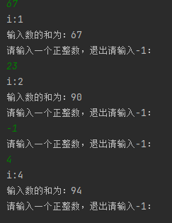

当输入-1后i也进行了加一操作。

## 大数

当基本的浮点数和整数精度不足以满足时，可以用java.math中的两个类：BigInteger（任意精度的整数运算）和BigDecimal（任意精度的浮点数运算）。这两个类可以处理包含任意长度数字序列。

使用静态方法*valueOf*()方法可以把一个普通的数转换为大数：
~~~java
BigInteger a = BigInteger.valueOf(100);
~~~

对于更长的数可以使用一个·带字符串参数的构造器：
~~~java
BigInteger reallyBig = new BigInteger("976342315410845627125064364031758374348543");
~~~

注意不能使用算术运算符来对大数进行组合，例如：（+，*）就要使用大数类中的add和multiply方法：
~~~java
BigInteger c = a.add(b);//c=a+b
BigInteger d = c.multiply(b.add(BigInteger.valueOf(2)));//d = c*(b+2)
~~~

## 数组

### 声明数组

数组是一种数据结构，用来存储同一类型的集合。
~~~java
//声明数组a
int[] a;
int a[];
//声明一个可以存储100个整数的数组
int[] a = new int[100];
var a = new int[100];
//声明一个数组a并且直接往里面传入参数
int[] a={1,2,3,4,5,6,7};
~~~

### for each 循环

使用for each循环可以打印出数组中的所有值。
~~~java
int[] a={1,2,3,4,5,6,7};
for (int x : a)
    System.out.println(x+" ");//输出为1 2 3 4 5 6 7
~~~

当然使用**`Arrays类`**中的**`tostring方法`**会返回一个包含数组元素的字符串，我感觉更简单。
~~~java
int[] a={1,2,3,4,5,6,7};
System.out.println(Arrays.toString(a));//输出为[1, 2, 3, 4, 5, 6, 7]
~~~

当然可以 👍
 “数组拷贝”是 Java 初学者**非常容易混淆**的知识点。
 我们来系统地、通俗地讲解一下 Java 中数组拷贝的几种方式和区别👇

------

### 数组拷贝

在 Java 中，**数组是引用类型**。
 所以：

```java
int[] a = {1, 2, 3};
int[] b = a;
```

这不是拷贝，而是——

> b 和 a 指向的是同一个数组对象。

------

例子：

```java
int[] a = {1, 2, 3};
int[] b = a;
b[0] = 99;
System.out.println(a[0]);
```

输出结果是：

```
99
```

✅ 因为 `a` 和 `b` 是同一个数组的两个“引用”。
 这叫 **引用拷贝（浅拷贝）**。

------

#### 真正的“数组拷贝”有三种常用方法

| 方法                 | 说明                   | 是否深拷贝 | 示例                                      |
| -------------------- | ---------------------- | ---------- | ----------------------------------------- |
| `System.arraycopy()` | 系统底层拷贝，速度最快 | ✅ 是       | `System.arraycopy(a, 0, b, 0, a.length);` |
| `Arrays.copyOf()`    | Java 提供的简化方法    | ✅ 是       | `int[] b = Arrays.copyOf(a, a.length);`   |
| `clone()`            | 数组自带方法           | ✅ 是       | `int[] b = a.clone();`                    |

------

##### ① `System.arraycopy()` —— 最底层、最高效的方式

```java
int[] a = {1, 2, 3, 4};
int[] b = new int[4];

System.arraycopy(a, 0, b, 0, a.length);

b[0] = 99;
System.out.println(a[0]); // 输出 1，不受影响
```

✅ 拷贝的是“值”，不是引用。
 ⚠️ 要先创建目标数组 `b`，并保证长度够用。

**参数说明：**

```
System.arraycopy(源数组, 源起始位置, 目标数组, 目标起始位置, 拷贝长度);
```

------

##### ② `Arrays.copyOf()` —— 最常用、最安全

```java
import java.util.Arrays;

int[] a = {1, 2, 3};
int[] b = Arrays.copyOf(a, a.length);
```

如果第二个参数大于原数组长度，会自动用默认值补足。

```java
int[] b = Arrays.copyOf(a, 5);
System.out.println(Arrays.toString(b));
// 输出 [1, 2, 3, 0, 0]
```

------

##### ③ `clone()` —— 最简单的方式

```java
int[] a = {1, 2, 3};
int[] b = a.clone();
```

拷贝完成后互不影响：

```java
b[0] = 99;
System.out.println(a[0]); // 输出 1
```

------

##### 总结

| 方法                 | 是否创建新数组 | 拷贝类型 | 是否修改原数组 | 推荐度   |
| -------------------- | -------------- | -------- | -------------- | -------- |
| `b = a`              | ❌ 否           | 引用拷贝 | ✅ 会修改       | ⚠️ 不推荐 |
| `System.arraycopy()` | ✅ 是           | 值拷贝   | ❌ 不修改       | ✅ 推荐   |
| `Arrays.copyOf()`    | ✅ 是           | 值拷贝   | ❌ 不修改       | ✅ 推荐   |
| `a.clone()`          | ✅ 是           | 值拷贝   | ❌ 不修改       | ✅ 推荐   |

------

#### 注意：多维数组的“深拷贝”问题

如果是二维数组，比如：

```java
int[][] a = {{1,2}, {3,4}};
int[][] b = a.clone();
```

这只是 **浅拷贝**，即：

- 外层数组被复制了；
- 内层的 `{1,2}`、`{3,4}` 仍然是同一个对象。

要想真正的“完全独立”，需要 **手动复制每一层**：

```java
int[][] b = new int[a.length][];
for (int i = 0; i < a.length; i++) {
    b[i] = a[i].clone();
}
```

------

#### 总结

| 场景         | 推荐方法                       |
| ------------ | ------------------------------ |
| 拷贝一维数组 | `Arrays.copyOf()` 或 `clone()` |
| 拷贝部分数组 | `System.arraycopy()`           |
| 拷贝多维数组 | 手动逐层拷贝                   |

------

### 数组排序

下面用一个从固定范围里抽取固定个数的随机数来进行演示

~~~java
import java.util.Arrays;
import java.util.Scanner;
public class HelloWorld {
    public static void main(String[] args) {
        Scanner scanner = new Scanner(System.in);
        System.out.println("请输入你要抽取几个数字：");
        int k = scanner.nextInt();
        System.out.println("请输入数字选择的范围中的最大数字：");
        int n = scanner.nextInt();
        int[] x = new int[n];
        for(int i = 0;i<x.length;i++){
            x[i] = i + 1;
        }
        int[] y = new int[k];
        for(int i = 0;i<y.length;i++){
            int r = (int) (Math.random()*n);//Math.random()生成一个0到1之间的浮点数，乘以n并且强制转换为整数类型得到一个在n范围内的随机数
            y [i] = x [r];
            x [r] = x [n-1];//这里是x [r]等于x [n-1]，x [n-1]等于x [r]
            n--;
        }
        Arrays.sort(y);//这里对数字进行升序
        System.out.println("这一次的随机数为：");
        System.out.println(Arrays.toString(y));j

    }
}
~~~

输出结果：
~~~java
C:\Users\zxp15\.jdks\corretto-18.0.2\bin\java.exe "-javaagent:D:\idea\IntelliJ IDEA 2023.1\lib\idea_rt.jar=61315:D:\idea\IntelliJ IDEA 2023.1\bin" -Dfile.encoding=UTF-8 -Dsun.stdout.encoding=UTF-8 -Dsun.stderr.encoding=UTF-8 -classpath D:\projects\Java_Learn\out\production\Java_Learn HelloWorld
请输入你要抽取几个数字：
6
请输入数字选择的范围中的最大数字：
79
这一次的随机数为：
[2, 4, 5, 33, 55, 72]

进程已结束,退出代码0

~~~

------

### 多维数组

在 Java 中，二维数组其实是“**数组的数组**”。

~~~java
import java.util.Arrays;
//计算不同利率下投资10000有多少收益
public class HelloWorld {
    public static void main(String[] args) {
        final double GAI_LU = 10;
        final int HENG = 6;//行数
        final int LIE = 10;//列数
        double[] a = new double[HENG];
        //计算利率10%，11%,12%,13%,14%,15%，并且传参给数组a
        for (int i=0;i < a.length;i++){
            a[i] = (GAI_LU+i) / 100.0;
        }
        System.out.println(Arrays.toString(a));
        
        double[][] b = new double[LIE][HENG];//传参为列，行
        //创建二维数组并且给第一行传参初始资金10000
        for(int i=0;i < b[0].length;i++){
            b[0][i]=10000;
        }
        System.out.println("-----------------------------------------------------------");
        System.out.println(Arrays.toString(b[0]));
        //向二维数组中传参用收益加本金
        for(int i=0;i < b.length-1;i++){
            for(int j=0;j < b[i+1].length;j++) {
                double x = a[j] * b[i][j];//计算出收益
                b[i + 1][j] = x + b[i][j];//计算出本届加收益然后传参
            }
        }
        for(int j = 0;j < a.length; j++)
            System.out.printf("%9.0f%%",100*a[j]);// 打印每一列对应的百分比（标题行）
        System.out.println();
        for (double[] row : b){
            for (double y : row){
                System.out.printf("%10.2f",y);// 打印每个元素（保留两位小数，右对齐）
            }
            System.out.println();
        }
    }
}
~~~

输出结果：
~~~java
C:\Users\zxp15\.jdks\corretto-18.0.2\bin\java.exe "-javaagent:D:\idea\IntelliJ IDEA 2023.1\lib\idea_rt.jar=61280:D:\idea\IntelliJ IDEA 2023.1\bin" -Dfile.encoding=UTF-8 -Dsun.stdout.encoding=UTF-8 -Dsun.stderr.encoding=UTF-8 -classpath D:\projects\Java_Learn\out\production\Java_Learn HelloWorld
    
[0.1, 0.11, 0.12, 0.13, 0.14, 0.15]
-----------------------------------------------------------
[10000.0, 10000.0, 10000.0, 10000.0, 10000.0, 10000.0]
       10%       11%       12%       13%       14%       15%
  10000.00  10000.00  10000.00  10000.00  10000.00  10000.00
  11000.00  11100.00  11200.00  11300.00  11400.00  11500.00
  12100.00  12321.00  12544.00  12769.00  12996.00  13225.00
  13310.00  13676.31  14049.28  14428.97  14815.44  15208.75
  14641.00  15180.70  15735.19  16304.74  16889.60  17490.06
  16105.10  16850.58  17623.42  18424.35  19254.15  20113.57
  17715.61  18704.15  19738.23  20819.52  21949.73  23130.61
  19487.17  20761.60  22106.81  23526.05  25022.69  26600.20
  21435.89  23045.38  24759.63  26584.44  28525.86  30590.23
  23579.48  25580.37  27730.79  30040.42  32519.49  35178.76

进程已结束,退出代码0

~~~

------

### 不规则数组

例如：

```java
int[][] b = new int[3][];
b[0] = new int[1];
b[1] = new int[2];
b[2] = new int[3];
```

结构示意图：

```
b → [ [0],
       [0,0],
       [0,0,0] ]
```

- `b.length = 3`
- 但：
  - `b[0].length = 1`
  - `b[1].length = 2`
  - `b[2].length = 3`
- 每行单独分配，可以节省空间，也能灵活表达“不对称”的数据结构。

| 特性     | 规则二维数组         | 不规则二维数组                |
| -------- | -------------------- | ----------------------------- |
| 定义方式 | `new int[m][n]`      | `new int[m][]` + 每行单独分配 |
| 每行长度 | 相同                 | 可不同                        |
| 内存使用 | 占用较多，但结构整齐 | 更节省，灵活                  |
| 使用场景 | 表格、矩阵等固定结构 | 三角形、金字塔等变长数据      |
| 示例     | 成绩表、图片像素矩阵 | Pascal三角形、动态表格        |

假设：

```java
int[][] tri = new int[4][];
for (int i = 0; i < tri.length; i++) {
    tri[i] = new int[i + 1];
    for (int j = 0; j < tri[i].length; j++)
        tri[i][j] = j + 1;
}
```

输出：

```
1
1 2
1 2 3
1 2 3 4
```

每一行比上一行多一个元素，这就是不规则数组的典型形状。

## 面向对象

### 访问权限控制

实际上Java中是有访问权限控制的，就是我们个人的隐私的一样，我不允许别人随便来查看我们的隐私，只有我们自己同意的情况下，才能告诉别人我们的名字、年龄等隐私信息。

所以说Java中引入了访问权限控制（可见性），我们可以为成员变量、成员方法、静态变量、静态方法甚至是类指定访问权限，不同的访问权限，有着不同程度的访问限制：

- `private` - 私有，标记为私有的内容无法被除当前类以外的任何位置访问。
- `什么都不写` - 默认，默认情况下，只能被类本身和同包中的其他类访问。
- `protected` - 受保护，标记为受保护的内容可以能被类本身和同包中的其他类访问，也可以被子类访问（子类我们会在下一章介绍）
- `public` - 公共，标记为公共的内容，允许在任何地方被访问。

这四种访问权限，总结如下表：

|           | 当前类 | 同一个包下的类 | 不同包下的子类 | 不同包下的类 |
| :-------: | :----: | :------------: | :------------: | :----------: |
|  public   |   ✅    |       ✅        |       ✅        |      ✅       |
| protected |   ✅    |       ✅        |       ✅        |      ❌       |
|   默认    |   ✅    |       ✅        |       ❌        |      ❌       |
|  private  |   ✅    |       ❌        |       ❌        |      ❌       |

比如我们刚刚出现的情况，就是因为是默认的访问权限，所以说在当前包以外的其他包中无法访问，但是我们可以提升它的访问权限，来使得外部也可以访问：

java复制代码

```java
public class Person {
    public String name;   //在name变量前添加public关键字，将其可见性提升为公共等级
    int age;
    String sex;
}
```

这样我们就可以在外部正常使用这个属性了：

java复制代码

```java
public static void main(String[] args) {
    Person person = new Person();
    System.out.println(person.name);   //正常访问到成员变量
}
```

实际上如果各位小伙伴观察仔细的话，会发现我们创建出来的类自带的访问等级就是`public`：

java复制代码

```java
package com.test.entity;

public class Person {   //class前面有public关键字

}
```

也就是说这个类实际上可以在任何地方使用，但是我们也可以将其修改为默认的访问等级：

java复制代码

```java
package com.test.entity;

class Person {    //去掉public变成默认等级
  
}
```

如果是默认等级的话，那么在外部同样是无法访问的：


但是注意，我们创建的普通类不能是`protected`或是`private`权限，因为我们目前所使用的普通类要么就是只给当前的包内使用，要么就是给外面都用，如果是`private`谁都不能用，那这个类定义出来干嘛呢？

如果某个类中存在静态方法或是静态变量，那么我们可以通过静态导入的方式将其中的静态方法或是静态变量直接导入使用，但是同样需要有访问权限的情况下才可以：

java复制代码

```java
public class Person {
    String name;
    int age;
    String sex;
    
    public static void test(){
        System.out.println("我是静态方法！");
    }
}
```

我们来尝试一下静态导入：

java复制代码

```java
import static com.test.entity.Person.test;    //静态导入test方法

public class Main {
    public static void main(String[] args) {
        test();    //直接使用就可以，就像在这个类定义的方法一样
    }
}
```

------

### 封装、继承和多态

封装、继承和多态是面向对象编程的三大特性。

> 封装，把对象的属性和方法结合成一个独立的整体，隐藏实现细节，并提供对外访问的接口。
>
> 继承，从已知的一个类中派生出一个新的类，叫子类。子类实现了父类所有非私有化的属性和方法，并根据实际需求扩展出新的行为。
>
> 多态，多个不同的对象对同一消息作出响应，同一消息根据不同的对象而采用各种不同的方法。

正是这三大特性，让我们的Java程序更加生动形象。

#### 类的封装

封装的目的是为了保证变量的安全性，使用者不必在意具体实现细节，而只是通过外部接口即可访问类的成员，如果不进行封装，类中的实例变量可以直接查看和修改，可能给整个代码带来不好的影响，因此在编写类时一般将成员变量私有化，外部类需要使用Getter和Setter方法来查看和设置变量。

我们可以将之前的类进行改进：

java复制代码

```java
public class Person {
    private String name;    //现在类的属性只能被自己直接访问
    private int age;
    private String sex;
  
  	public Person(String name, int age, String sex) {   //构造方法也要声明为公共，否则对象都构造不了
        this.name = name;
        this.age = age;
        this.sex = sex;
    }

    public String getName() {
        return name;    //想要知道这个对象的名字，必须通过getName()方法来获取，并且得到的只是名字值，外部无法修改
    }

    public String getSex() {
        return sex;
    }

    public int getAge() {
        return age;
    }
}
```

我们可以来试一下：

java复制代码

```java
public static void main(String[] args) {
    Person person = new Person("小明", 18, "男");
    System.out.println(person.getName());    //只能通过调用getName()方法来获取名字
}
```

也就是说，外部现在只能通过调用我定义的方法来获取成员属性，而我们可以在这个方法中进行一些额外的操作，比如小明可以修改名字，但是名字中不能包含"小"这个字：

java复制代码

```java
public void setName(String name) {
    if(name.contains("小")) return;
    this.name = name;
}
```

我们甚至还可以将构造方法改成私有的，需要通过我们的内部的方式来构造对象：

java复制代码

```java
public class Person {
    private String name;
    private int age;
    private String sex;

    private Person(){}   //不允许外部使用new关键字创建对象
    
    public static Person getInstance() {   //而是需要使用我们的独特方法来生成对象并返回
        return new Person();
    }
}
```

通过这种方式，我们可以实现单例模式：

> java复制代码
>
> ```java
> public class Test {
>  private static Test instance;
> 
>  private Test(){}
> 
>  public static Test getInstance() {
>      if(instance == null) 
>          instance = new Test();
>      return instance;
>  }
> }
> ```
>
> 单例模式就是全局只能使用这一个对象，不能创建更多的对象，我们就可以封装成这样，关于单例模式的详细介绍，还请各位小伙伴在《Java设计模式》视频教程中再进行学习。

封装思想其实就是把实现细节给隐藏了，外部只需知道这个方法是什么作用，而无需关心实现，要用什么由类自己来做，不需要外面来操作类内部的东西去完成，封装就是通过访问权限控制来实现的。

#### 类的继承

前面我们介绍了类的封装，我们接着来看一个非常重要特性：继承。

在定义不同类的时候存在一些相同属性，为了方便使用可以将这些共同属性抽象成一个父类，在定义其他子类时可以继承自该父类，减少代码的重复定义，子类可以使用父类中**非私有**的成员。

比如说我们一开始使用的人类，那么实际上人类根据职业划分，所掌握的技能也会不同，比如画家会画画，歌手会唱，舞者会跳，Rapper会rap，运动员会篮球，我们可以将人类这个大类根据职业进一步地细分出来：

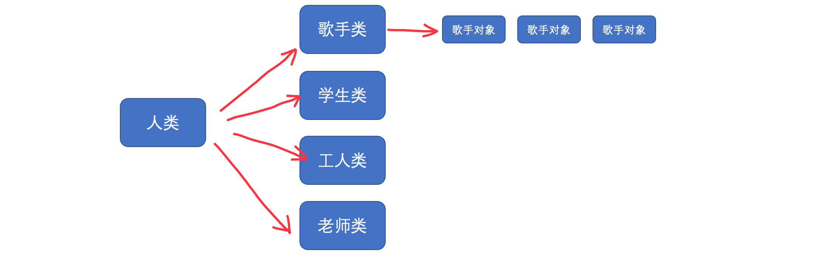


实际上这些划分出来的类，本质上还是人类，也就是说人类具有的属性，这些划分出来的类同样具有，但是，这些划分出来的类同时也会拥有他们自己独特的技能。在Java中，我们可以创建一个类的子类来实现上面的这种效果：

java复制代码

```java
public class Person {   //先定义一个父类
    String name;
    int age;
    String sex;
}
```

接着我们可以创建各种各样的子类，想要继承一个类，我们只需要使用`extends`关键字即可：

java复制代码

```java
public class Worker extends Person{    //工人类
    
}
```

java复制代码

```java
public class Student extends Person{   //学生类

}
```

类的继承可以不断向下，但是同时只能继承一个类，同时，标记为`final`的类不允许被继承：

java复制代码

```java
public final class Person {  //class前面添加final关键字表示这个类已经是最终形态，不能继承
  
}
```

当一个类继承另一个类时，属性会被继承，可以直接访问父类中定义的属性，除非父类中将属性的访问权限修改为`private`，那么子类将无法访问（但是依然是继承了这个属性的）：

java复制代码

```java
public class Student extends Person{
    public void study(){
        System.out.println("我的名字是 "+name+"，我在学习！");   //可以直接访问父类中定义的name属性
    }
}
```

同样的，在父类中定义的方法同样会被子类继承：

java复制代码

```java
public class Person {
    String name;
    int age;
    String sex;

    public void hello(){
        System.out.println("我叫 "+name+"，今年 "+age+" 岁了!");
    }
}
```

子类直接获得了此方法，当我们创建一个子类对象时就可以直接使用这个方法：

java复制代码

```java
public static void main(String[] args) {
    Student student = new Student();
    student.study();    //子类不仅有自己的独特技能
    student.hello();    //还继承了父类的全部技能
}
```

是不是感觉非常人性化，子类继承了父类的全部能力，同时还可以扩展自己的独特能力，就像一句话说的： 龙生龙凤生凤，老鼠儿子会打洞。

如果父类存在一个有参构造方法，子类必须在构造方法中调用：

java复制代码

```java
public class Person {
    protected String name;   //因为子类需要用这些属性，所以说我们就将这些变成protected，外部不允许访问
    protected int age;
    protected String sex;
    protected String profession;

  	//构造方法也改成protected，只能子类用
    protected Person(String name, int age, String sex, String profession) {
        this.name = name;
        this.age = age;
        this.sex = sex;
        this.profession = profession;
    }

    public void hello(){
        System.out.println("["+profession+"] 我叫 "+name+"，今年 "+age+" 岁了!");
    }
}
```

可以看到，此时两个子类都报错了：

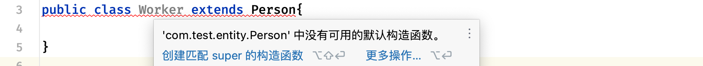


因为子类在构造时，不仅要初始化子类的属性，还需要初始化父类的属性，所以说在默认情况下，子类其实是调用了父类的构造方法的，只是在无参的情况下可以省略，但是现在父类构造方法需要参数，那么我们就需要手动指定了：

既然现在父类需要三个参数才能构造，那么子类需要按照同样的方式调用父类的构造方法：

java复制代码

```java
public class Student extends Person{
    public Student(String name, int age, String sex) {    //因为学生职业已经确定，所以说学生直接填写就可以了
        super(name, age, sex, "学生");   //使用super代表父类，父类的构造方法就是super()
    }

    public void study(){
        System.out.println("我的名字是 "+name+"，我在学习！");
    }
}
```

java复制代码

```java
public class Worker extends Person{
    public Worker(String name, int age, String sex) {
        super(name, age, sex, "工人");    //父类构造调用必须在最前面
        System.out.println("工人构造成功！");    //注意，在调用父类构造方法之前，不允许执行任何代码，只能在之后执行
    }
}
```

我们在使用子类时，可以将其当做父类来使用：

java复制代码

```java
public static void main(String[] args) {
    Person person = new Student("小明", 18, "男");    //这里使用父类类型的变量，去引用一个子类对象（向上转型）
    person.hello();    //父类对象的引用相当于当做父类来使用，只能访问父类对象的内容
}
```

虽然我们这里使用的是父类类型引用的对象，但是这并不代表子类就彻底变成父类了，这里仅仅只是当做父类使用而已。

我们也可以使用强制类型转换，将一个被当做父类使用的子类对象，转换回子类：

java复制代码

```java
public static void main(String[] args) {
    Person person = new Student("小明", 18, "男");
    Student student = (Student) person;   //使用强制类型转换（向下转型）
    student.study();
}
```

但是注意，这种方式只适用于这个对象本身就是对应的子类才可以，如果本身都不是这个子类，或者说就是父类，那么会出现问题：

java复制代码

```java
public static void main(String[] args) {
    Person person = new Worker("小明", 18, "男");   //实际创建的是Work类型的对象
    Student student = (Student) person;
    student.study();
}
```

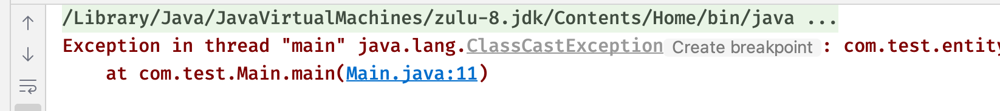


此时直接出现了类型转换异常，因为本身不是这个类型，强转也没用。

那么如果我们想要判断一下某个变量所引用的对象到底是什么类，那么该怎么办呢？

java复制代码

```java
public static void main(String[] args) {
    Person person = new Student("小明", 18, "男");
    if(person instanceof Student) {   //我们可以使用instanceof关键字来对类型进行判断
        System.out.println("对象是 Student 类型的");
    }
    if(person instanceof Person) {
        System.out.println("对象是 Person 类型的");
    }
}
```

如果变量所引用的对象是对应类型或是对应类型的子类，那么`instanceof`都会返回`true`，否则返回`false`。

最后我们需要来特别说明一下，子类是可以定义和父类同名的属性的：

java复制代码

```java
public class Worker extends Person{
    protected String name;   //子类中同样可以定义name属性
    
    public Worker(String name, int age, String sex) {
        super(name, age, sex, "工人");
    }
}
```

此时父类的name属性和子类的name属性是同时存在的，那么当我们在子类中直接使用时：

java复制代码

```java
public void work(){
    System.out.println("我是 "+name+"，我在工作！");   //这里的name，依然是作用域最近的哪一个，也就是在当前子类中定义的name属性，而不是父类的name属性
}
```

所以说，我们在使用时，实际上这里得到的结果为`null`：

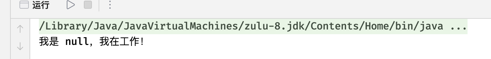


那么，在子类存在同名变量的情况下，怎么去访问父类的呢？我们同样可以使用`super`关键字来表示父类：

java复制代码

```java
public void work(){
    System.out.println("我是 "+super.name+"，我在工作！");   //这里使用super.name来表示需要的是父类的name变量
}
```

这样得到的结果就不一样了：

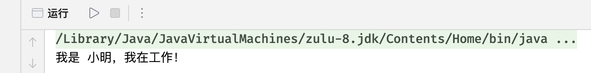


但是注意，没有`super.super`这种用法，也就是说如果存在多级继承的话，那么最多只能通过这种方法访问到父类的属性（包括继承下来的属性）

### (Java 16) 类型判断模式匹配

在Java 14，`instanceof`迎来了一波小更新，之前我们判断某个对象是否为某个类型或是某个类型的子类时，会用到`instanceof`关键字：

java复制代码

```java
public static void main(String[] args) {
    test(new Student());
}

//实现如果是学生就执行study方法
private static void test(Person person) {
    if(person instanceof Student) {   //首先判断是否为学生类型
        Student student = (Student) person;  //如果是直接进行强制类型转换
        student.study();   //执行学习
    }
}

static class Person { }
static class Student extends Person {
    void study() {
        System.out.println("我要打瓦");
    }
}
```

在之前我们一直都是采用这种先判断类型，然后类型转换，最后才能使用的方式，但是这个版本`instanceof`加强之后，我们就不需要了，我们可以直接将student替换为模式变量：

java复制代码

```java
private static void test(Person person) {
    if(person instanceof Student student) {  //直接在instanceof后写变量名称，作为判断成功之后转换的此类型变量名称
        student.study();
    }
}
```

在使用`instanceof`判断类型成立后，会自动强制转换类型为指定类型，我们只需要指定强制转换之后的变量名称，简化了我们手动转换的步骤。注意此功能在Java 16中才实装，到Java 17才能不转换类型直接使用。

### 方法的重写

注意，方法的重写不同于之前的方法重载，不要搞混了，方法的重载是为某个方法提供更多种类，而方法的重写是覆盖原有的方法实现，比如我们现在不希望使用Object类中提供的`equals`方法，那么我们就可以将其重写了：

java复制代码

```java
public class Person{
    ...

    @Override   //重写方法可以添加 @Override 注解，有关注解我们会在最后一章进行介绍，这个注解默认情况下可以省略
    public boolean equals(Object obj) {   //重写方法要求与父类的定义完全一致
        if(obj == null) return false;   //如果传入的对象为null，那肯定不相等
        if(obj instanceof Person) {     //只有是当前类型的对象，才能进行比较，要是都不是这个类型还比什么
            Person person = (Person) obj;   //先转换为当前类型，接着我们对三个属性挨个进行比较
            return this.name.equals(person.name) &&    //字符串内容的比较，不能使用==，必须使用equals方法
                    this.age == person.age &&       //基本类型的比较跟之前一样，直接==
                    this.sex.equals(person.sex);
        }
        return false;
    }
}
```

在重写Object提供的`equals`方法之后，就会按照我们的方式进行判断了：

java复制代码

```java
public static void main(String[] args) {
    Person p1 = new Student("小明", 18, "男");
    Person p2 = new Student("小明", 18, "男");
    System.out.println(p1.equals(p2));   //此时由于三个属性完全一致，所以说判断结果为真，即使是两个不同的对象
}
```

有时候为了方便查看对象的各个属性，我们可以将Object类提供的`toString`方法重写了：

java复制代码

```java
@Override
public String toString() {    //使用IDEA可以快速生成
    return "Person{" +
            "name='" + name + '\'' +
            ", age=" + age +
            ", sex='" + sex + '\'' +
            ", profession='" + profession + '\'' +
            '}';
}
```

这样，我们直接打印对象时，就会打印出对象的各个属性值了：

java复制代码

```java
public static void main(String[] args) {
    Person person = new Student("小明", 18, "男");
    System.out.println(person);
}
```

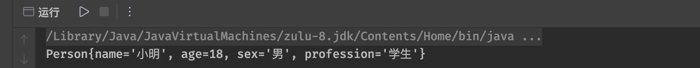


注意，静态方法不支持重写，因为它是属于类本身的，但是它可以被继承。

基于这种方法可以重写的特性，对于一个类定义的行为，不同的子类可以出现不同的行为，比如考试，学生考试可以得到A，而工人去考试只能得到D：

java复制代码

```java
public class Person {
    ...

    public void exam(){
        System.out.println("我是考试方法");
    }
  
  	...
}
```

java复制代码

```java
public class Student extends Person{
    ...

    @Override
    public void exam() {
        System.out.println("我是学生，我就是小镇做题家，拿个 A 轻轻松松");
    }
}
```

java复制代码

```java
public class Worker extends Person{
    ...

    @Override
    public void exam() {
        System.out.println("我是工人，做题我并不擅长，只能得到 D");
    }
}
```

这样，不同的子类，对于同一个方法会产生不同的结果：

java复制代码

```java
public static void main(String[] args) {
    Person person = new Student("小明", 18, "男");
    person.exam();

    person = new Worker("小强", 18, "男");
    person.exam();
}
```

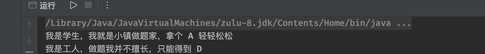


这其实就是面向对象编程中多态特性的一种体现。

注意，我们如果不希望子类重写某个方法，我们可以在方法前添加`final`关键字，表示这个方法已经是最终形态：

java复制代码

```java
public final void exam(){
    System.out.println("我是考试方法");
}
```


或者，如果父类中方法的可见性为`private`，那么子类同样无法访问，也就不能重写，但是可以定义同名方法：

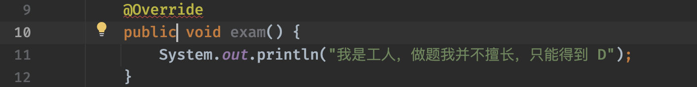


虽然这里可以编译通过，但是并不是对父类方法的重写，仅仅是子类自己创建的一个新方法。

还有，我们在重写父类方法时，如果希望调用父类原本的方法实现，那么同样可以使用`super`关键字：

java复制代码

```java
@Override
public void exam() {
    super.exam();   //调用父类的实现
    System.out.println("我是工人，做题我并不擅长，只能得到 D");
}
```

然后就是访问权限的问题，子类在重写父类方法时，不能降低父类方法中的可见性：

java复制代码

```java
public void exam(){
    System.out.println("我是考试方法");
}
```

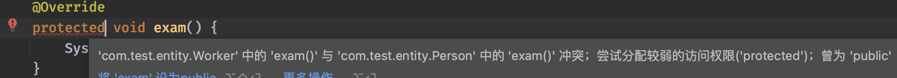


因为子类实际上可以当做父类使用，如果子类的访问权限比父类还低，那么在被当做父类使用时，就可能出现无视访问权限调用的情况，这样肯定是不行的，但是相反的，我们可以在子类中提升权限：

java复制代码

```java
protected void exam(){
    System.out.println("我是考试方法");
}
```

java复制代码

```java
@Override
public void exam() {   //将可见性提升为public 
    System.out.println("我是工人，做题我并不擅长，只能得到 D");
}
```

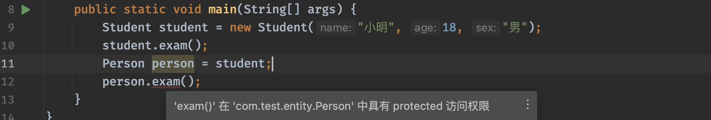


可以看到作为子类时就可以正常调用，但是如果将其作为父类使用，因为访问权限不足所有就无法使用，总之，子类重写的方法权限不能比父类还低。

### 抽象类

在我们学习了类的继承之后，实际上我们会发现，越是处于顶层定义的类，实际上可以进一步地进行抽象，比如我们前面编写的考试方法：

java复制代码

```java
protected void exam(){
    System.out.println("我是考试方法");
}
```

这个方法再子类中一定会被重写，所以说除非子类中调用父类的实现，否则一般情况下永远都不会被调用，就像我们说一个人会不会考试一样，实际上人怎么考试是一个抽象的概念，而学生怎么考试和工人怎么考试，才是具体的一个实现，所以说，我们可以将人类进行进一步的抽象，让某些方法完全由子类来实现，父类中不需要提供实现。

要实现这样的操作，我们可以将人类变成抽象类，抽象类比类还要抽象：

java复制代码

```java
public abstract class Person {   //通过添加abstract关键字，表示这个类是一个抽象类
    protected String name;   //大体内容其实普通类差不多
    protected int age;
    protected String sex;
    protected String profession;

    protected Person(String name, int age, String sex, String profession) {
        this.name = name;
        this.age = age;
        this.sex = sex;
        this.profession = profession;
    }

    public abstract void exam();   //抽象类中可以具有抽象方法，也就是说这个方法只有定义，没有方法体
}
```

而具体的实现，需要由子类来完成，而且如果是子类，必须要实现抽象类中所有抽象方法：

java复制代码

```java
public class Worker extends Person{

    public Worker(String name, int age, String sex) {
        super(name, age, sex, "工人");
    }

    @Override
    public void exam() {   //子类必须要实现抽象类所有的抽象方法，这是强制要求的，否则会无法通过编译
        System.out.println("我是工人，做题我并不擅长，只能得到 D");
    }
}
```

抽象类由于不是具体的类定义（它是类的抽象）可能会存在某些方法没有实现，因此无法直接通过new关键字来直接创建对象：

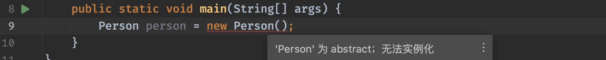


要使用抽象类，我们只能去创建它的子类对象。

抽象类一般只用作继承使用，当然，抽象类的子类也可以是一个抽象类：

java复制代码

```java
public abstract class Student extends Person{   //如果抽象类的子类也是抽象类，那么可以不用实现父类中的抽象方法
    public Student(String name, int age, String sex) {
        super(name, age, sex, "学生");
    }

    @Override   //抽象类中并不是只能有抽象方法，抽象类中也可以有正常方法的实现
    public void exam() {
        System.out.println("我是学生，我就是小镇做题家，拿个 A 轻轻松松");
    }
}
```

注意，抽象方法的访问权限不能为`private`：

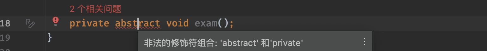


因为抽象方法一定要由子类实现，如果子类都访问不了，那么还有什么意义呢？所以说不能为私有。

### 接口

接口甚至比抽象类还抽象，他只代表某个确切的功能！也就是只包含方法的定义，甚至都不是一个类！接口一般只代表某些功能的抽象，接口包含了一些列方法的定义，类可以实现这个接口，表示类支持接口代表的功能（类似于一个插件，只能作为一个附属功能加在主体上，同时具体实现还需要由主体来实现）

咋一看，这啥意思啊，什么叫支持接口代表的功能？实际上接口的目标就是将类所具有某些的行为抽象出来。

比如说，对于人类的不同子类，学生和老师来说，他们都具有学习这个能力，既然都有，那么我们就可以将学习这个能力，抽象成接口来进行使用，只要是实现这个接口的类，都有学习的能力：

java复制代码

```java
public interface Study {    //使用interface表示这是一个接口
    void study();    //接口中只能定义访问权限为public抽象方法，其中public和abstract关键字可以省略
}
```

我们可以让类实现这个接口：

java复制代码

```java
public class Student extends Person implements Study {   //使用implements关键字来实现接口
    public Student(String name, int age, String sex) {
        super(name, age, sex, "学生");
    }

    @Override
    public void study() {    //实现接口时，同样需要将接口中所有的抽象方法全部实现
        System.out.println("我会学习！");
    }
}
```

java复制代码

```java
public class Teacher extends Person implements Study {
    protected Teacher(String name, int age, String sex) {
        super(name, age, sex, "教师");
    }

    @Override
    public void study() {
        System.out.println("我会加倍学习！");
    }
}
```

接口不同于继承，接口可以同时实现多个：

java复制代码

```java
public class Student extends Person implements Study, A, B, C {  //多个接口的实现使用逗号隔开
  
}
```

所以说有些人说接口其实就是Java中的多继承，但是我个人认为这种说法是错的，实际上实现接口更像是一个类的功能列表，作为附加功能存在，一个类可以附加很多个功能，接口的使用和继承的概念有一定的出入，顶多说是多继承的一种替代方案。

接口跟抽象类一样，不能直接创建对象，但是我们也可以将接口实现类的对象以接口的形式去使用：

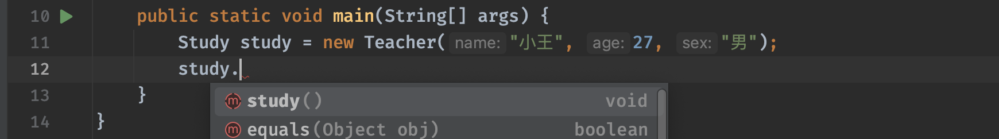


当做接口使用时，只有接口中定义的方法和Object类的方法，无法使用类本身的方法和父类的方法。

接口同样支持向下转型：

java复制代码

```java
public static void main(String[] args) {
    Study study = new Teacher("小王", 27, "男");
    if(study instanceof Teacher) {   //直接判断引用的对象是不是Teacher类型
        Teacher teacher = (Teacher) study;   //强制类型转换
        teacher.study();
    }
}
```

这里的使用其实跟之前的父类是差不多的，体现了多态的特性。

接口不同于类，正常情况下，接口中不允许存在成员变量和成员方法，它是一个非常纯粹的定义，所以它相比抽象类来说还要更抽象。不过和类一样，接口是可以继承自其他接口的：

java复制代码

```java
public interface A exetnds B {
  
}
```

并且接口没有继承数量限制，接口支持多继承：

java复制代码

```java
public interface A exetnds B, C, D {
  
}
```

接口的继承相当于是对接口功能的融合罢了。

最后我们来介绍一下Object类中提供的克隆方法，为啥要留到这里才来讲呢？因为它需要实现接口才可以使用：

java复制代码

```java
package java.lang;

public interface Cloneable {    //这个接口中什么都没定义
}
```

实现接口后，我们还需要将克隆方法的可见性提升一下，不然还用不了：

java复制代码

```java
public class Student extends Person implements Study, Cloneable {   //首先实现Cloneable接口，表示这个类具有克隆的功能
    public Student(String name, int age, String sex) {
        super(name, age, sex, "学生");
    }

    @Override
    public Object clone() throws CloneNotSupportedException {   //提升clone方法的访问权限
        return super.clone();   //因为底层是C++实现，我们直接调用父类的实现就可以了
    }

    @Override
    public void study() {
        System.out.println("我会学习！");
    }
}
```

接着我们来尝试一下，看看是不是会得到一个一模一样的对象：

java复制代码

```java
public static void main(String[] args) throws CloneNotSupportedException {  //这里向上抛出一下异常，还没学异常，所以说照着写就行了
    Student student = new Student("小明", 18, "男");
    Student clone = (Student) student.clone();   //调用clone方法，得到一个克隆的对象
    System.out.println(student);
    System.out.println(clone);
    System.out.println(student == clone);
}
```

可以发现，原对象和克隆对象，是两个不同的对象，但是他们的各种属性都是完全一样的：

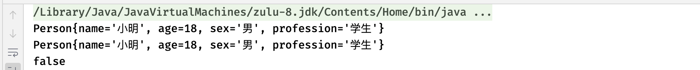


通过实现接口，我们就可以很轻松地完成对象的克隆了，在我们之后的学习中，还会经常遇到接口的使用。

**注意：** 以下内容为选学内容，在设计模式篇视频教程中有详细介绍。

> 克隆操作可以完全复制一个对象的所有属性，但是像这样的拷贝操作其实也分为浅拷贝和深拷贝。
>
> - **浅拷贝：** 对于类中基本数据类型，会直接复制值给拷贝对象；对于引用类型，只会复制对象的地址，而实际上指向的还是原来的那个对象，拷贝个基莫。
> - **深拷贝：** 无论是基本类型还是引用类型，深拷贝会将引用类型的所有内容，全部拷贝为一个新的对象，包括对象内部的所有成员变量，也会进行拷贝。
>
> 那么clone方法出来的克隆对象，是深拷贝的结果还是浅拷贝的结果呢？
>
> java复制代码
>
> ```java
> public static void main(String[] args) throws CloneNotSupportedException {
>     Student student = new Student("小明", 18, "男");
>     Student clone = (Student) student.clone();
>     System.out.println(student.name == clone.name);
> }
> ```
>
> 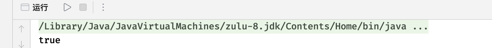
>
> 可以看到，虽然Student对象成功拷贝，但是其内层对象并没有进行拷贝，依然只是对象引用的复制，所以Java为我们提供的`clone`方法只会进行浅拷贝。

### (Java 8) 接口默认和静态方法

从Java8开始，接口中可以存在方法的默认实现：

java复制代码

```java
public interface Study {
    void study();

    default void test() {   //使用default关键字为接口中的方法添加默认实现
        System.out.println("我是默认实现");
    }
}
```

如果方法在接口中存在默认实现，那么实现类中不强制要求进行实现。

在之前接口中不允许存在任何实现的方法和和变量，从Java8开始，这些限制同样也放宽了，虽然还是不支持直接像抽象类那样写成员变量，但是静态变量和静态方法是可以写了：

java复制代码

```java
public interface Study {
    public static final int a = 10;   //接口中定义的静态变量可以是public static final的
  
  	public static void test(){    //接口中定义的静态方法只能是public的
        System.out.println("我是静态方法");
    }
    
    void study();
}
```

跟普通的类一样，我们可以直接通过接口名.的方式使用静态内容：

java复制代码

```java
public static void main(String[] args) {
    System.out.println(Study.a);
         Study.test();
}
```

有了这些特性之后，接口似乎变得也不是那么完全纯粹的抽象了。

------

### 内部类

#### 成员内部类

>成员内部类调用方法：
>
>**`外部类名 外部类对象 = new 外部类名（）；`**
>
>**`外部类名 . 内部类名 内部类对象 = 外部类对象 . new 外部类名（）；`**

案例：

~~~java
package javaSE.Inner_class;
//成员内部类
public class Member_Internal_Class {
    public static void main(String[] args) {
        Outer outer = new Outer();
        Outer.Inner inner = outer.new Inner();//调用成员内部类格式
        inner.show();
        outer.test2();
    }
}
class Outer{
    int m = 0;
    void test1(){
        System.out.println("外部类方法test1（）");
    }
    //成员内部类Inner
    class Inner{
        int n = 1;
        //成员内部类show方法
        void show(){
            System.out.println("外部类成员变量m="+m);
            test1();
        }
        //成员内部类show2方法
        void show2(){
            System.out.println("内部类成员方法show2（）");
        }
    }
    void test2(){
        Inner inner = new Inner();
        System.out.println("内部类成员变量n="+inner.n);
        inner.show2();
    }
}
~~~

结果：

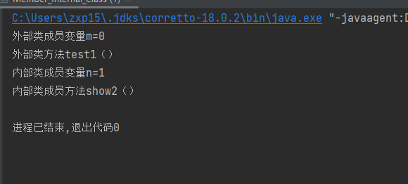


------

#### 局部内部类

>又名方法内部类，是指某个局部范围中的类，它和局部变量都是方法中定义的，`有效范围只限于方法内部`！！！

案例：

~~~java
package javaSE.Inner_class;

public class local_inner_class {
    public static void main(String[] args) {
        Outer1 outer1 = new Outer1();
        outer1.test2();
    }
}
class Outer1{
    int m = 0;
    void test1(){
        System.out.println("外部类方法test1（）");
    }
    void test2(){
        //定义一个局部内部类，在局部内部类中访问外部类的变量和方法
        class Inner1{
            int n = 1;
            void show(){
                System.out.println("外部类成员变量m="+m);
                test1();
            }
        }
        //访问局部内部类中的变量和方法
        Inner1 inner1 = new Inner1();
        System.out.println("局部内部类变量 n = " + inner1.n);
        inner1.show();
    }
}
~~~

结果：

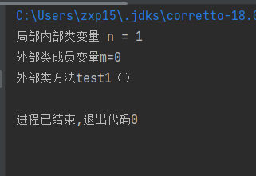

------

#### 静态内部类

>静态内部类调用方法：
>
>**`外部类名 . 静态内部类名 变量名 = new 外部类名 . 静态内部类名（）；`**

案例：

~~~java
package javaSE.Inner_class;

public class Static_inner_classes {
    public static void main(String[] args) {
        Outer2.Inner2 inner2 = new Outer2.Inner2();
        inner2.show();
    }
}
class Outer2{
    static int m = 0;
    static class Inner2{
        int n = 1;
        void show(){
            //在静态内部类的方法中访问外部类的静态变量m
            System.out.println("外部类成员变量m="+m);
        }
    }
}
~~~

结果：

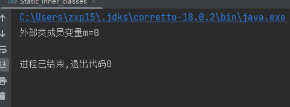

------

#### 匿名内部类

>匿名内部类调用方法：
>
>**`new 继承的父类或实体的接口名（）{`**
>
>​         **` 匿名内部类的类体`**
>
>**`}`**

案例：

~~~java
package javaSE.Inner_class;
interface Animal{
    void shout();
}
public class anonymous_inner_class {
    public static void main(String[] args) {
        String name = "小花";
        animalShout(new Animal() {
            @Override
            public void shout() {
                System.out.println(name + "喵喵......");
            }
        });
    }
    public static void animalShout(Animal an){
        an.shout();
    }
}
~~~

结果：

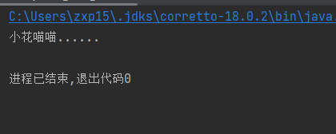

------

### 时间类LocalDate

#### 计算x年x月x日到现在还有多少天

~~~java
import java.time.LocalDate;
import java.time.temporal.ChronoUnit;

public class Main {
    public static void main(String[] args) {
        // 假设目标日期是 2025 年 12 月 31 日
        LocalDate targetDate = LocalDate.of(2025, 12, 31);

        // 获取今天的日期
        LocalDate today = LocalDate.now();

        // 计算相差天数（targetDate - today）
        long days = ChronoUnit.DAYS.between(today, targetDate);

        System.out.println("距离 " + targetDate + " 还有 " + days + " 天。");
    }
}

~~~


以打印日历为例：
~~~java
import java.time.DayOfWeek;
import java.time.LocalDate;
public class Print_calendar {
    public static void main(String[] args) {
        // LocalDate localDate = LocalDate.now();获取当前时间
        LocalDate localDate = LocalDate.of(2003, 2, 25);
        System.out.println(localDate);
        int month = localDate.getMonthValue();
        int day = localDate.getDayOfMonth();
        // 括号里的内容为当前时间-过去了几天，变成了月初。例如：今天是11月4日，那就是4-1等于3，再拿11月4日中日减去3为1，就变成了11月1日
        localDate = localDate.minusDays(day-1);
        System.out.println(localDate);
        DayOfWeek dayOfWeek = localDate.getDayOfWeek();
        int value = dayOfWeek.getValue();
        System.out.println("Mon Tue Wed Thu Fri Sat Sun");
        for (int i = 1; i < value ;i++ ){
            System.out.print("    ");
        }
        while (localDate.getMonthValue()==month){
            System.out.printf("%3d",localDate.getDayOfMonth());
            if (localDate.getDayOfMonth() == day){
                System.out.print("*");
            }
            else {
                System.out.print(" ");
            }
            localDate = localDate.plusDays(1);//日期加一
            if (localDate.getDayOfWeek().getValue() == 1) System.out.println();
        }
        if (localDate.getDayOfWeek().getValue() != 1) System.out.println();
    }
}
~~~

运行结果：
~~~java
2003-02-25
2003-02-01
Mon Tue Wed Thu Fri Sat Sun
                      1   2 
  3   4   5   6   7   8   9 
 10  11  12  13  14  15  16 
 17  18  19  20  21  22  23 
 24  25* 26  27  28 

~~~


 下面我帮你整理出 **`java.time.LocalDate`** 类中最常用、最实用的函数（含说明 + 示例），让你查阅时一目了然。

------

####  一、获取当前日期相关

| 方法                                         | 说明                                     | 示例                                           |
| -------------------------------------------- | ---------------------------------------- | ---------------------------------------------- |
| `LocalDate.now()`                            | 获取系统当前日期                         | `LocalDate today = LocalDate.now();`           |
| `LocalDate.of(int year, int month, int day)` | 创建指定日期对象                         | `LocalDate date = LocalDate.of(2025, 11, 4);`  |
| `LocalDate.parse(String text)`               | 从字符串解析日期（默认格式：yyyy-MM-dd） | `LocalDate d = LocalDate.parse("2025-11-04");` |

------

####  二、获取日期的各个组成部分

| 方法              | 返回值类型  | 说明                              | 示例输出   |
| ----------------- | ----------- | --------------------------------- | ---------- |
| `getYear()`       | `int`       | 获取年份                          | `2025`     |
| `getMonth()`      | `Month`     | 获取月份枚举（如 `NOVEMBER`）     | `NOVEMBER` |
| `getMonthValue()` | `int`       | 获取月份数值（1-12）              | `11`       |
| `getDayOfMonth()` | `int`       | 获取当月的“日”                    | `4`        |
| `getDayOfWeek()`  | `DayOfWeek` | 获取星期几的枚举（MONDAY~SUNDAY） | `TUESDAY`  |
| `getDayOfYear()`  | `int`       | 获取当年的第几天（1~365/366）     | `308`      |
| `lengthOfMonth()` | `int`       | 获取当前月有几天                  | `30`       |
| `lengthOfYear()`  | `int`       | 获取当前年有几天                  | `365`      |

------

####  三、日期计算函数（非常常用）

| 方法                      | 功能           | 示例                  | 结果           |
| ------------------------- | -------------- | --------------------- | -------------- |
| `plusDays(long n)`        | 加 n 天        | `d.plusDays(10)`      | 日期往后 10 天 |
| `minusDays(long n)`       | 减 n 天        | `d.minusDays(5)`      | 日期往前 5 天  |
| `plusWeeks(long n)`       | 加 n 周        | `d.plusWeeks(2)`      | 日期往后 2 周  |
| `minusWeeks(long n)`      | 减 n 周        | `d.minusWeeks(1)`     | 日期往前 1 周  |
| `plusMonths(long n)`      | 加 n 月        | `d.plusMonths(1)`     | 下个月同日     |
| `minusMonths(long n)`     | 减 n 月        | `d.minusMonths(3)`    | 往前 3 个月    |
| `plusYears(long n)`       | 加 n 年        | `d.plusYears(1)`      | 明年同日       |
| `minusYears(long n)`      | 减 n 年        | `d.minusYears(1)`     | 去年同日       |
| `withDayOfMonth(int day)` | 设置为指定“日” | `d.withDayOfMonth(1)` | 当月第一天     |
| `withMonth(int month)`    | 设置为指定“月” | `d.withMonth(12)`     | 改为 12 月     |
| `withYear(int year)`      | 设置为指定“年” | `d.withYear(2030)`    | 改为 2030 年   |

------

#### 四、日期比较与判断

| 方法                        | 返回类型  | 说明                 | 示例              |
| --------------------------- | --------- | -------------------- | ----------------- |
| `isBefore(LocalDate other)` | `boolean` | 是否早于另一个日期   | `d1.isBefore(d2)` |
| `isAfter(LocalDate other)`  | `boolean` | 是否晚于另一个日期   | `d1.isAfter(d2)`  |
| `isEqual(LocalDate other)`  | `boolean` | 是否与另一个日期相同 | `d1.isEqual(d2)`  |
| `isLeapYear()`              | `boolean` | 是否闰年             | `d.isLeapYear()`  |

------

####  五、其他有用方法

| 方法                         | 说明                                           | 示例                                   |
| ---------------------------- | ---------------------------------------------- | -------------------------------------- |
| `atStartOfDay()`             | 转换为当天 00:00 的 `LocalDateTime`            | `LocalDateTime dt = d.atStartOfDay();` |
| `compareTo(LocalDate other)` | 比较两个日期大小（负、零、正）                 | `d1.compareTo(d2)`                     |
| `toEpochDay()`               | 转换为自 1970-01-01 起的天数（可用于计算间隔） | `d.toEpochDay()`                       |

------

####  六、示例演示

```java
import java.time.LocalDate;
import java.time.DayOfWeek;

public class LocalDateDemo {
    public static void main(String[] args) {
        LocalDate today = LocalDate.now();
        System.out.println("今天是：" + today);
        System.out.println("年份：" + today.getYear());
        System.out.println("月份：" + today.getMonthValue());
        System.out.println("日：" + today.getDayOfMonth());
        System.out.println("星期：" + today.getDayOfWeek());
        System.out.println("当月天数：" + today.lengthOfMonth());

        LocalDate firstDay = today.withDayOfMonth(1);
        LocalDate lastDay = today.withDayOfMonth(today.lengthOfMonth());
        System.out.println("本月第一天：" + firstDay);
        System.out.println("本月最后一天：" + lastDay);

        LocalDate tenDaysLater = today.plusDays(10);
        System.out.println("10天后：" + tenDaysLater);

        System.out.println("是否闰年：" + today.isLeapYear());
    }
}
```

输出示例（假设今天是 2025-11-04）：

```
今天是：2025-11-04
年份：2025
月份：11
日：4
星期：TUESDAY
当月天数：30
本月第一天：2025-11-01
本月最后一天：2025-11-30
10天后：2025-11-14
是否闰年：false
```

------

## 自定义类

下面以工资管理系统为例子：
~~~java
import java.time.LocalDate;

public class Payroll_management {
    public static void main(String[] args) {
        payroll[] payrolls = new payroll[3];

        payrolls[0] = new payroll("张三",15000,2025,10,1);
        payrolls[1] = new payroll("李四",20000,2025,10,2);
        payrolls[2] = new payroll("王五",40000,2025,10,3);

        for (payroll p:payrolls)
            p.raiseSalary(5);// 每个人涨5%的工资

        for (payroll p:payrolls)
            System.out.println("姓名："+p.getName()+",工资："+p.getSalary()+",雇佣日："+p.getHireDay());
    }
}

class payroll{
    private String name;
    private double salary;
    private LocalDate hireDay;
    public  payroll(String n, double s,int year,int month, int day){
        name = n;
        salary = s;
        hireDay = LocalDate.of(year,month,day);
    }
    public String getName(){
        return name;
    }
    public double getSalary(){
        return salary;
    }
    public LocalDate getHireDay(){
        return hireDay;
    }
    public void raiseSalary(double a){
        double raise = salary * (a / 100);
        salary += raise;
    }
}
~~~

输出结果：
~~~java
姓名：张三,工资：15750.0,雇佣日：2025-10-01
姓名：李四,工资：21000.0,雇佣日：2025-10-02
姓名：王五,工资：42000.0,雇佣日：2025-10-03
~~~

### Objects类提供非空参数方法

如上代码所示工资管理系统中姓名，雇佣日不可能为**`null`**或者**`""，" "`**。
对于提供值为**`null`**的情况我们可以使用**`Objects`**中的**`requireNonNull()`**或者**`*requireNonNullElse*()`**方法：

~~~java
name = Objects.requireNonNullElse(n,"unknown");//这条代码在name为null时可以运行，但会自动把null替换为unknown
name = Objects.requireNonNull(n,"unknown");//这条代码在name为null时会直接报错！！！
~~~

对于提供值为**`""，" "`**时我们需要额外加一个判定：
~~~java
if (name.trim().isEmpty()) {
    throw new IllegalArgumentException("名字不能为空或仅包含空格");
}
~~~

`trim()` 会去掉字符串两端的空格，
 `isEmpty()` 判断是否长度为 0。

------

## 对象构造

以分配员工唯一ID这个项目为例子：
~~~java
import java.util.*;
public class constructorTest {
    public static void main(String[] args) {
        var staff = new Employee1[3];
        staff[0] = new Employee1("harry",40000);
        staff[1] = new Employee1(60000);
        staff[2] = new Employee1();

        for(Employee1 e : staff)
            System.out.println("name=" + e.getName() + ",id=" + e.getId() + ",salary=" +e.getSalary());
    }
}

class Employee1{
    private  static int nextId;

    private  int id;
    private String name="";
    private double salary;
    private static Random generator = new Random();

    // 静态初始化块
    /*
    * 这个代码块在 类第一次加载时执行一次。
    * 随机给 nextId 一个初始值（0~9999）。
    * 所有对象共享同一个 nextId 静态变量。*/
    static {
        nextId = generator.nextInt(10000);//
    }

    //对象初始化块
    /*
     * 每创建一个对象，这个块都会执行一次。
     * 作用：在调用构造函数之前，先为对象分配一个唯一的 id。
     * 然后自增 nextId，确保下一个员工获得不同的 id。
     * */
    {
        id = nextId;
        nextId++;
    }
    
    // 手动传入姓名和工资。
    public Employee1(String n,double s){
        name = n;
        salary = s;
    }

    /*
     * 如果只给了工资，那么自动用 "Employee1 #id" 生成名字。
     * 这里调用了上面的构造函数（this() 表示调用本类的另一个构造器）。*/
    public Employee1(double s){
        this("Employee1 #"+nextId,s);
    }

    // 无参构造器，不设置任何值，name 默认是空字符串 ""，工资默认是 0.0。
    public Employee1(){

    }

    public String getName(){
        return name;
    }

    public double getSalary(){
        return salary;
    }

    public int getId(){
        return id;
    }

}
~~~

假设随机数生成器得到的初始 `nextId = 9321`
执行过程如下：

| 对象     | 调用构造器               | 初始化块赋 id | 最终 name       | salary |
| -------- | ------------------------ | ------------- | --------------- | ------ |
| staff[0] | Employee1("harry",40000) | id=9321       | harry           | 40000  |
| staff[1] | Employee1(60000)         | id=9322       | Employee1 #9322 | 60000  |
| staff[2] | Employee1()              | id=9323       | ""              | 0.0    |

### 总结

| 特性             | 说明                                                   |
| ---------------- | ------------------------------------------------------ |
| **静态块**       | 类加载时执行一次，用于初始化静态变量。                 |
| **实例初始化块** | 每次创建对象时都会执行（在构造函数之前）。             |
| **构造器重载**   | 同一个类中定义多个构造器，根据参数不同调用不同的版本。 |
| **静态变量**     | 属于类而非对象，所有实例共享同一个值。                 |
| **this()**       | 调用同一个类中的其他构造方法，必须放在构造器第一行。   |

------

## 记录

下面以一段代码为例：
~~~java
import java.util.*;
public class Record_text {
    public static void main(String[] args) {
        var p = new Point(3,4);
        System.out.println("坐标为："+p.x()+","+p.y());
        System.out.println("与原点的位置："+p.distanceFromOrigin());//计算点到原点的距离
        System.out.println("距离原点的位置："+ Point.distance(Point.ORIGIN,p));//调用静态方法，计算两点间距离。

        var pt = new PointInTime(3,4,new Date());
        System.out.println("之前："+pt);
        pt.when().setTime(0);//注意：record 是不可变的，但 Date 是可变对象！
        System.out.println("之后："+pt);

        var r = new Range(4,3);
        System.out.println("r:"+r);

    }
}
record Point(double x, double y) {
    public Point() {
        this(0, 0);
    }

    public double distanceFromOrigin() {
        return Math.hypot(x, y);
    }

    public static Point ORIGIN = new Point();

    public static double distance(Point p, Point q) {
        return Math.hypot(p.x - q.x, p.y - q.y);
    }
}
record PointInTime(double x,double y,Date when){}

record Range(int from,int to){
    // 紧凑构造器
    public Range{
        if(from > to){
            int temp = from;
            from = to;
            to = temp;
        }
    }
}
~~~

运行结果：
~~~java
坐标为：3.0,4.0
与原点的位置：5.0
距离原点的位置：5.0
Point[x=3.0, y=4.0]
之前：PointInTime[x=3.0, y=4.0, when=Sun Nov 09 15:39:28 CST 2025]
之后：PointInTime[x=3.0, y=4.0, when=Thu Jan 01 08:00:00 CST 1970]
r:Range[from=3, to=4]
~~~

| record 名称   | 含义                      | 特点                             |
| ------------- | ------------------------- | -------------------------------- |
| `Point`       | 表示一个二维坐标点 (x, y) | 带有静态常量、静态方法和普通方法 |
| `PointInTime` | 表示某个坐标点 + 时间     | 结合 `Date` 使用                 |
| `Range`       | 表示一个区间 [from, to]   | 自动调整顺序，使 from ≤ to       |

### 总结

| 特点                                            | 说明                 |
| ----------------------------------------------- | -------------------- |
| 自动生成 `toString()`、`equals()`、`hashCode()` | 代码更简洁           |
| 所有字段默认 `final`                            | 不可变对象，线程安全 |
| 可定义普通方法、静态变量、静态方法              | 功能灵活             |
| 可定义紧凑构造器                                | 对输入进行验证或调整 |

| 项目                  | 说明                                     |
| --------------------- | ---------------------------------------- |
| **紧凑构造器作用**    | 在 record 初始化前，验证或修正参数       |
| **为什么交换 3 和 4** | 因为区间的起点必须小于终点，否则逻辑错误 |
| **好处**              | 自动保证对象的合法性，减少错误           |

