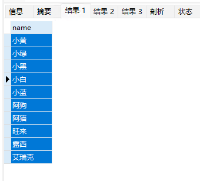
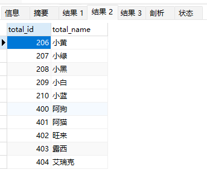

# MySQL数据库

>注意`MySQL命令`不区分大小写！每一个命令后面都需**`；`**！！！

## 数据库命令

### 创建数据库

以创建Bookstore数据库为例

```sql
CREATE DATABASE Bookstore;
```

------

### 使用数据库

采用`use`命令

~~~sql
USE Bookstore;
~~~

------

### 查询所有数据库

采用`show`命令

~~~sql
SHOW DATABASES;
~~~

------

### 修改数据库

采用`alter`命令

以修改Bookstore数据库的默认字符集为`latin1`，校对规则为`latin1_swedish_ci`为例；

~~~sql
ALTER DATABASE Bookstore 
DEFAULT CHARACTER SET latin1 #修改默认字符集
DEFAULT COLLATE latin1_swedish_ci;#修改校对规则
~~~

------

### 删除数据库

采用`drop`命令

~~~sql
DROP DATABASE Bookstore; 
~~~

------

## 数据类型

### 数值类型（Numeric Types）

| 类型            | 字节    | 说明       | 取值范围             | 使用场景       | 备注       |
| --------------- | ------- | ---------- | -------------------- | -------------- | ---------- |
| ⭐ TINYINT       | 1       | 很小的整数 | -128 ~ 127（有符号） | 状态值、布尔值 | 常用于0/1  |
| ⭐ SMALLINT      | 2       | 小整数     | -32768 ~ 32767       | 小范围计数     |            |
| ⭐ INT / INTEGER | 4       | 标准整数   | ±21亿                | 主键、自增ID   | 最常用     |
| ⭐ BIGINT        | 8       | 大整数     | 非常大               | 订单号、雪花ID |            |
| MEDIUMINT       | 3       | 中等整数   | ±800万               | 较少用         |            |
| ⭐ FLOAT         | 4       | 单精度浮点 | 精度较低             | 科学计算       | 有误差     |
| ⭐ DOUBLE        | 8       | 双精度浮点 | 精度较高             | 金融以外计算   |            |
| ⭐ DECIMAL(M,D)  | 可变    | 精确小数   | 精确存储             | 金额、价格     | 推荐用于钱 |
| BIT             | 1字节起 | 位字段     | 0/1                  | 标志位         |            |

👉 **重点说明：**

- ⭐金额必须用 `DECIMAL`，不能用 FLOAT / DOUBLE（会丢精度）
- ⭐`INT` 是最常用整数类型
- ⭐`TINYINT` 常用作布尔（0/1）

------

### 字符串类型（String Types）

| 类型         | 最大长度 | 说明           | 使用场景     | 备注         |
| ------------ | -------- | -------------- | ------------ | ------------ |
| ⭐ CHAR(n)    | 255      | 固定长度字符串 | 性别、状态码 | 快但浪费空间 |
| ⭐ VARCHAR(n) | 65535    | 可变长度字符串 | 用户名、邮箱 | 最常用       |
| TINYTEXT     | 255B     | 短文本         | 简短描述     |              |
| TEXT         | 64KB     | 文本           | 文章内容     | 常用         |
| MEDIUMTEXT   | 16MB     | 大文本         | 长文章       |              |
| LONGTEXT     | 4GB      | 超大文本       | 日志、全文   |              |
| ⭐ ENUM       | 列表     | 枚举值         | 性别、状态   | 限定值       |
| SET          | 集合     | 多选枚举       | 标签         |              |

👉 **重点说明：**

- ⭐`VARCHAR` 最常用（必须掌握）
- ⭐`TEXT` 用于大文本
- ⭐`ENUM` 适合固定选项（但扩展性差）

------

### 日期时间类型（Date & Time）

| 类型        | 字节 | 格式                | 范围         | 使用场景 | 备注     |
| ----------- | ---- | ------------------- | ------------ | -------- | -------- |
| ⭐ DATE      | 3    | YYYY-MM-DD          | 1000-9999    | 出生日期 |          |
| ⭐ TIME      | 3    | HH:MM:SS            | -838~838小时 | 时间段   |          |
| ⭐ DATETIME  | 8    | YYYY-MM-DD HH:MM:SS | 1000-9999    | 创建时间 | 推荐     |
| ⭐ TIMESTAMP | 4    | 时间戳              | 1970-2038    | 自动时间 | 自动更新 |
| YEAR        | 1    | YYYY                | 1901-2155    | 年份     |          |

👉 **重点说明：**

- ⭐`DATETIME` 最常用
- ⭐`TIMESTAMP` 常用于自动更新时间
- 👉 区别：
  - `DATETIME`：存真实时间
  - `TIMESTAMP`：受时区影响 + 可自动更新

------

### 二进制类型（Binary Types）

| 类型         | 说明           | 使用场景  | 备注 |
| ------------ | -------------- | --------- | ---- |
| BINARY(n)    | 固定长度二进制 | 加密数据  |      |
| VARBINARY(n) | 可变二进制     | 文件片段  |      |
| TINYBLOB     | 小二进制       | 图片      |      |
| BLOB         | 二进制大对象   | 图片/文件 | 常用 |
| MEDIUMBLOB   | 中等大小       | 视频      |      |
| LONGBLOB     | 超大           | 大文件    |      |

👉 **说明：**

- ⚠️ 一般不推荐存文件到数据库（用OSS更好）

------

### JSON 类型（重点）

| 类型   | 说明         | 使用场景       | 备注       |
| ------ | ------------ | -------------- | ---------- |
| ⭐ JSON | JSON数据结构 | 前后端数据交互 | MySQL 5.7+ |

👉 **示例：**

```sql
INSERT INTO user (info) VALUES ('{"name":"张三","age":18}');
```

👉 **优势：**

- 灵活存储结构
- 类似 NoSQL

------

## 常用类型总结（重点）

| 场景          | 推荐类型       |
| ------------- | -------------- |
| 主键ID        | ⭐ BIGINT / INT |
| 用户名/字符串 | ⭐ VARCHAR      |
| 金额          | ⭐ DECIMAL      |
| 时间记录      | ⭐ DATETIME     |
| 状态值        | ⭐ TINYINT      |
| 长文本        | ⭐ TEXT         |
| 配置/结构数据 | ⭐ JSON         |

------

## 重要使用建议（面试/实战重点）

### 1. 为什么不用 FLOAT 存钱？

- 精度丢失 ❌
- 应使用：`DECIMAL(10,2)` ✅

------

### 2. CHAR vs VARCHAR

| 对比 | CHAR | VARCHAR |
| ---- | ---- | ------- |
| 长度 | 固定 | 可变    |
| 速度 | 快   | 略慢    |
| 空间 | 浪费 | 节省    |

👉 结论：**绝大多数用 VARCHAR**

------

### 3. DATETIME vs TIMESTAMP

| 对比     | DATETIME | TIMESTAMP |
| -------- | -------- | --------- |
| 范围     | 很大     | 受限      |
| 自动更新 | ❌        | ✅         |
| 推荐     | ⭐        | ⭐         |

------

### 4. TEXT vs VARCHAR

- VARCHAR：查询快 ✅
- TEXT：适合大文本 ✅

------

### 实战建表示例

```sql
CREATE TABLE user (
    id BIGINT PRIMARY KEY AUTO_INCREMENT,
    username VARCHAR(50),
    password VARCHAR(100),
    age INT,
    balance DECIMAL(10,2),
    status TINYINT,
    create_time DATETIME,
    profile TEXT,
    extra JSON
);
```

------

## 表格

>注意表格数据库的书写规范一把在表名或者数据库名左右加上``代表数据库或者表名或者列名！！！

### 创建表格

使用`create`命令

以创建student表格为例

~~~sql
CREATE TABLE `student`(
`student_id` INT AUTO_INCREMENT PRIMARY KEY,#加入AUTO_INCREMENT当你不写id时自动帮你写入id从1开始
`name` VARCHAR(20) NOT NULL,#给表格加约束名字属性不能为空
`major` VARCHAR(20) UNIQUE,#给专业加约束专业必须唯一
`class` VARCHAR(20) DEFAULT '1班'#默认值约束：插入数据时如果不指定 class，自动填充为 1班
);
~~~

#### 自动填入id

在创建表格中数据的数据类型后加入`AUTO_INCREMENT`就可以不写入这个属性，会自动帮你从1开始写入

#### 不为空约束

在创建表格中数据的数据类型后加入`NOT NULL`就强制约束这个数据不为空，必须填值

#### 设置默认值

在创建表格中数据的数据类型后加入`DEFAULT '写要填的默认值'`就可以不写入这个属性，让这个属性默认为你设置的默认值

------

### 查询表格

>注意这里是查询表格属性！！！

使用`DESCRIBE`命令

~~~sql
DESCRIBE `student`;#查询表格
~~~

------

### 删除表格

使用`DROP`命令

~~~sql
DROP TABLE `student`;#删除表格 
~~~

------

### 查询表格内容

#### SELECT

使用`SELECT...FROM...;`命令;

~~~sql
SELECT * FROM `student`;#查询表中所有内容
~~~

#### UNION并集

>union是需要连接属性数量相对应1-1，或n-n,注意合并**数据类型**需要一样（就是拼接）
>
>例如员工名字union客户名字

~~~sql
SELECT `name` FROM `employee` UNION SELECT `client_name` FROM `client`;
~~~

结果：



>员工id + 员工名字 union 客户id + 客户名字

~~~sql
SELECT `emp_id`AS`total_id`,`name`AS`total_name` FROM `employee` UNION SELECT `client_id`,`client_name` FROM `client`; 
~~~

结果：



------

### 修改表格属性

采用`ALTER`命令

给student表添加一个属性，属性名为gpa，数据类型为DECIMAL(3,2)

~~~sql
ALTER TABLE `student` ADD gpa DECIMAL(3,2);#给表格添加属性
~~~

给student表删除一个属性，属性名为gpa

~~~sql
ALTER TABLE `student` DROP COLUMN gpa;#删除表格中的某一个属性
~~~

------

### 修改表名

采用`RENAME TABLE 表名1 TO 表名2；`方法

~~~sql
RENAME TABLE student TO student1;
~~~

------

### 复制表

使用`CREATE TABLE 表名2 LIKE 表名1;`方法

例如创造一个表结构和student相同的表，表名为student_copy

~~~sql
CREATE TABLE student_copy LIKE student;
~~~

### 修改表格数据

#### INSERT

>对表格插入数数据
>
>例如对student表插入一条数据 1,"小白","历史"

~~~sql
INSERT INTO `student` VALUES(1,"小白","历史");
~~~

#### UPDATE

>更新表格中的数据
>
>例如  更新表格class_1,当专业（major）为英语时，更改为(major)英语文学

~~~sql
UPDATE `class_1` SET `major` = '英语文学' WHERE `major` = '英语';
~~~

#### DELETE

>删除表格中的数据
>
>例如 删除class_1表中学号为4的数据

~~~sql
DELETE FROM `class_1` WHERE `student_id`=4;#删除表中数据
~~~

## 外键

>就相当于关联性，student有学号，class也有学号，那student的学号和class的学号肯定是对应的

### 例子

>

~~~SQL
-- 创建公司资料库表格

CREATE TABLE `employee`(
`emp_id` INT(3) PRIMARY KEY,
`name` VARCHAR(20) NOT NULL,
`birth_date` DATE NOT NULL,
`sex` VARCHAR(1) NOT NULL,
`salary` INT NOT NULL,
`branch_id` INT,
`sup_id` INT 
);

DESCRIBE `employee`;

CREATE TABLE `branch`(
`branch_id` INT(1) NOT NULL PRIMARY KEY,
`branch_name` VARCHAR(20) NOT NULL,
`manager_id` INT(3),
FOREIGN KEY (`manager_id`) REFERENCES `employee`(`emp_id`) ON DELETE SET NULL
#设置外键用employee中的emp_id属性和manger_id的属性进行约束关联
-- ON DELETE SET NULL的意思为如果`employee`(`emp_id`)中的一个属性被删除那就把与他对应的`manager_id`设置为NULL
);

DESCRIBE `branch`;

ALTER TABLE `employee` ADD FOREIGN KEY (`branch_id`) REFERENCES `branch`(`branch_id`) ON DELETE SET NULL;
ALTER TABLE `employee` ADD FOREIGN KEY (`sup_id`) REFERENCES `employee`(`emp_id`) ON DELETE SET NULL;


CREATE TABLE `client`(
`client_id` INT(3) NOT NULL PRIMARY KEY,
`client_name` VARCHAR(20) NOT NULL,
`phone` INT NOT NULL
);

DESCRIBE `client`;

CREATE TABLE `works_with`(
`emp_id` INT(3),
`client_id` INT(3),
`total_sales` INT NOT NULL,
PRIMARY KEY (`emp_id`,`client_id`),
FOREIGN KEY (`emp_id`) REFERENCES `employee`(`emp_id`) ON DELETE CASCADE,
-- ON DELETE CASCADE的意思为如果`employee`(`emp_id`)中的一个属性被删除那就把与他对应的(`emp_id`)的那一条属性删除
FOREIGN KEY (`client_id`) REFERENCES `client`(`client_id`) ON DELETE CASCADE
);

DESCRIBE `works_with`;

DELETE FROM `employee` WHERE `emp_id`=207;#连级删动

INSERT INTO `employee` VALUES(206,'小黄','1988-10-08','F',50000,1,NULL);#这里插入会显示直接失败因为branch_id是与branch表中的branch_id数据相连接的branch表中还没有数据！！！！

INSERT INTO `branch` VALUES(1,'研发',NULL);
INSERT INTO `branch` VALUES(2,'行政',NULL);
INSERT INTO `branch` VALUES(3,'资讯',NULL);#这里可以先将manager_id设置为null就可以导入数据了

UPDATE `branch` SET `manager_id`=206 WHERE `branch_id`=1;
UPDATE `branch` SET `manager_id`=207 WHERE `branch_id`=2;
UPDATE `branch` SET `manager_id`=208 WHERE `branch_id`=3;

SELECT * FROM `employee`;
SELECT * FROM `branch`;
SELECT * FROM `client`;
SELECT * FROM `works_with`;

-- 1.取得所有员工资料
SELECT * FROM `employee`;
-- 2.取得所有客户资料
SELECT * FROM `client`;
-- 3.按薪水从低到高获取员工资料
SELECT * FROM `employee` ORDER BY `salary`;
-- 4.取得薪水前三高的员工
SELECT * FROM `employee` ORDER BY `salary` DESC LIMIT 3;
-- 5.取得所有员工的名字
SELECT `name` FROM `employee`;
-- 6.查询员工性别种类（不允许重复）
SELECT `sex` FROM `employee`;#重复了！！
SELECT DISTINCT `sex` FROM `employee`;
~~~

