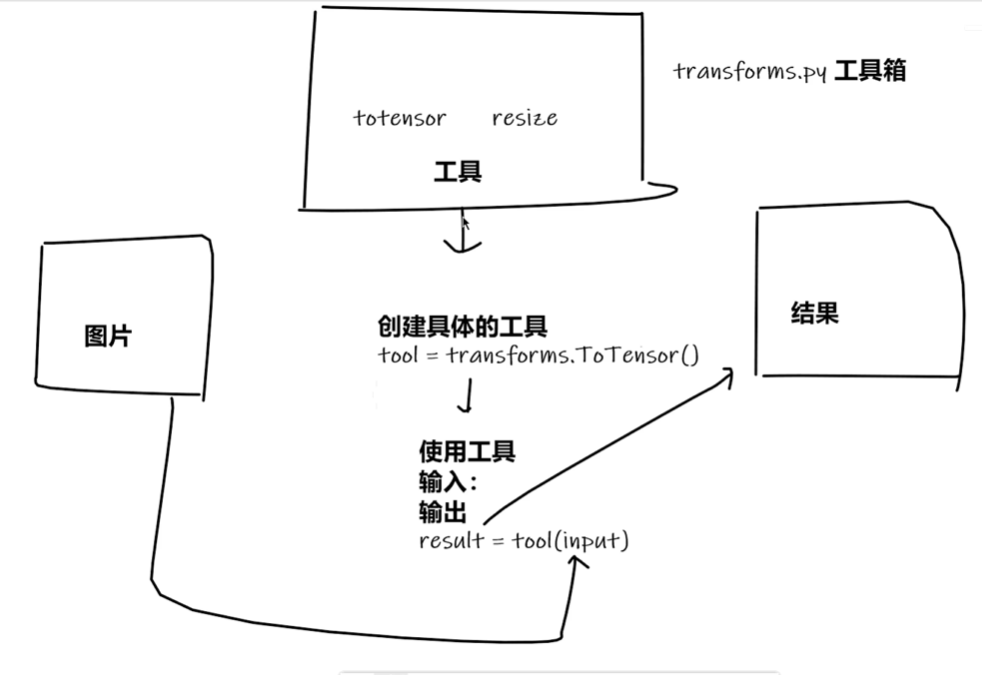
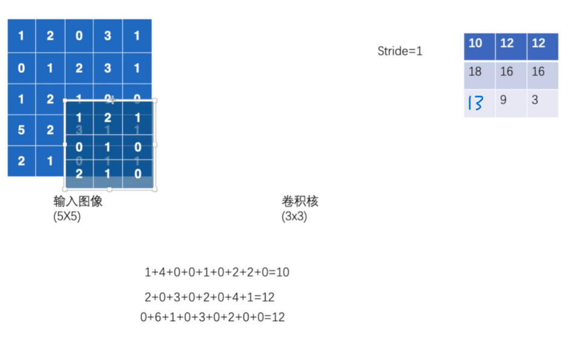
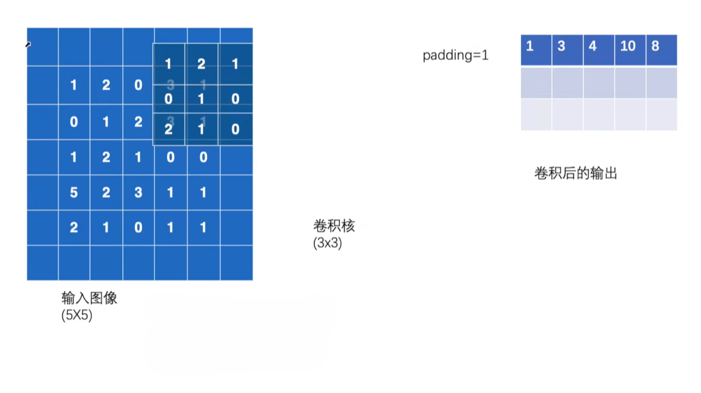
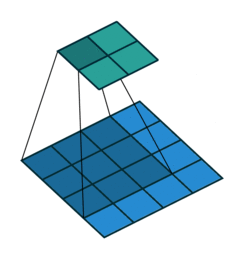
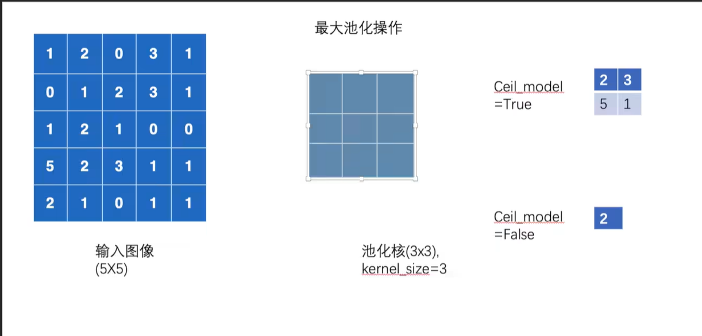
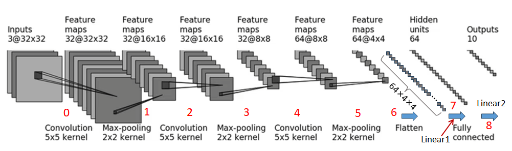

# PyTorch入门

## 读取数据

### 1.Dataset

提供一种方法获取数据及其相应的label（**真实标签**）

具体实现的功能：

- 获取每一个数据及其label
- 获取所有的数据

### 2.Dataloader

为后面的网络提供不同的数据形式

## Tensorboard的使用

~~~python
tensorboard --logdir=logs --port=6007
~~~

logdir=指定文件的历史（可由SummaryWriter生成的日志文件） port=指定端口号

## SummaryWriter的使用

将你在训练和测试模型过程中关心的各种数据（如损失、准确率、权重分布、图像、计算图等）**写入到日志文件中**然后，可以使用 TensorBoard 这个强大的可视化工具来读取和展示这些日志文件，从而直观地监控、分析和调试模型。

`SummaryWriter` 来自 `torch.utils.tensorboard` 库
导入方式：

~~~python
from torch.utils.tensorboard import SummaryWriter
~~~


它的**核心功能**可以归纳为以下几点：

1. 记录标量数据（Scalars）

   - 是什么：随着时间迭代步骤变化的单个数值。

   - 例子：训练损失，验证准确率，学习率等。

   - 方法：
     ~~~python
     add_scalar(),add_scalars()
     #add_scalar(标签，Y轴，X轴)
     ~~~

2. 记录图像数据（Images）

   - 是什么：模型输入，输出或中间特征图的可视化。

   - 例子：查看模型生成的图片，检查数据增强后的效果，可视化卷积层的滤波器响应。

   - 方法：
     ~~~python
     add_image(),add_images()
     ~~~

3. 记录模型结构（Graphs）

   - 是什么：计算图的可视化，展示了模型的数据流向和操作结构。

   - 例子：检查模型架构是否正确，理解数据在模型中的传递路径。

   - 方法：
     ~~~python
     add_graph()
     ~~~

4. 记录直方图（Histogarms）

   - 是什么：张量分布统计图表。

   - 例子：监控模型权重，偏置或梯度随训练过程的变化。如果分布变得很奇怪（例如全部变成0），可能意味着模型出现了梯度消失或爆炸等问题

   - 方法：

     ~~~python
     add_histogram()
     ~~~

5. 记录嵌入向量（Embeddings）

   - 是什么：高维数据的低维可视化（例如通过PCA或t-SNE降维）。

   - 例子：可视化词嵌入或最后一层隐藏层的特征，观察同类数据是否在空间中被聚集在一起。

   - 方法：

     ~~~python
     add_embedding()
     ~~~

6. 记录文本，音频等

   - 还可以记录音频片段 (`add_audio()`)、文本信息 (`add_text()`) 等，用途非常广泛。

## torchvision中的transforms

需要将图片转换为tensor数据类型



## 常见的transforms

输入：PIL
用法：Image.open()

输出：tensor
用法：ToTensor()

输出类型：ndarray（通过 cv2.imread() 读取）

### **normalize函数**

使用方法：

~~~ python
from PIL import Image
from torchvision import transforms
from torch.utils.tensorboard import SummaryWriter
img=Image.open("")
trans_totensor = transforms.ToTensor()
img_tensor=trans_totensor(img)
trans_normalize=transforms.Normalize([0.5,0.5,0.5],[0.5,0.5,0.5])
img_normalize=trans_normalize(img_tensor)#传入参数必须为tensor数据类型
~~~

| 特性         | 说明                                                         |
| :----------- | :----------------------------------------------------------- |
| **作用**     | 对图像数据进行标准化，使其均值为0，标准差为1。               |
| **目的**     | 加速模型训练收敛、提升模型稳定性和性能、匹配预训练模型的要求。 |
| **计算**     | `output = (input - mean) / std` （逐通道计算）               |
| **常用参数** | `mean=[0.485, 0.456, 0.406]`, `std=[0.229, 0.224, 0.225]` (ImageNet标准) |
| **使用顺序** | 必须在 `ToTensor()`（将数据转换为Tensor并缩放到[0,1]）之后使用。 |

### Compose函数

使用方法：

~~~python
trans_resize_2 = transforms.Resize(512)
trans_compose = transforms.Compose([trans_resize_2,trans_totensor])
img_resize_2= trans_compose(img)
~~~

**注意**
函数中传入的是列表和Java中的数组类似，上面的例子为先执行resize，再给数据转换为tensor类型

### Resize函数

使用方法：

~~~ python
trans_resize=transforms.Resize((512,512))
img_resize = trans_resize(img_tensor)
print(img_resize)
~~~

言简意赅就是对图片进行**缩放**

### RandomCrop函数

使用方法：
~~~python
trans_random = transforms.RandomCrop(512)
trans_compose_2 = transforms.Compose([trans_random,trans_totensor])
for i in range(10):
    img_crop = trans_compose_2(img)
    writer.add_image("RandomCrop",img_crop,i)
~~~

言简意赅就是对图像进行**裁剪**

## 函数使用方法

1. 关注输入和输出数据类型
2. 多调用官方文档进行观看
3. 关注方法需要什么参数

注意：
不知道返回值类型时多用print，print(type()),**debug(试错)**

## datasets与dataloader


使用方法：
~~~python
test_data = torchvision.datasets.CIFAR10(root='./dataset',train=False,transform=torchvision.transforms.ToTensor())
test_loader = DataLoader(dataset=test_data,batch_size=64,shuffle=False,num_workers=0,drop_last=True)

~~~

datasets是用来加载一整个数据集的就入上图所示（这里的数据集就假如是一整幅扑克牌）是加载这一整个数据集并打包。

dataloader是对datasets中打包的数据集进行**细致的**划分下面对其中的一些重要参数进行解释：

1. batch_size:对数据集中的数据进行打包，上面代码64是指对这个数据集的图片每64张为一个包进行划分。
2. shuffle：Ture是指对打包数据进行打乱，就是不按照顺序进行打包。False是指安装数据集中存放的顺序打包数据。
3. drop_last:Ture是指当数据按batch_size大小打包时最后一组不足以为batch_size时也进行打包。False则为当最后一组不足时进行删除操作。

## 神经网络的基本骨架

### nn.Module的使用

nn.Module(nn是指neural network)

`nn.Module` 是 **PyTorch** 中最核心的基类之一，几乎所有的深度学习模型（包括自定义的网络层、完整的神经网络等）都需要继承它。它的作用主要有以下几点：

------

#### 1. **统一管理网络结构**

- 你在定义神经网络时，需要写各个层（卷积层、全连接层、激活函数等）。
- 只要继承 `nn.Module`，就可以把这些层作为类的属性统一管理，方便调用和保存。

```python
import torch.nn as nn

class MyNet(nn.Module):
    def __init__(self):
        super(MyNet, self).__init__()
        self.fc1 = nn.Linear(10, 20)  # 定义第一层
        self.fc2 = nn.Linear(20, 1)   # 定义第二层
    
    def forward(self, x):  # 前向传播
        x = self.fc1(x)
        x = self.fc2(x)
        return x
```

------

#### 2. **自动注册参数**

- `nn.Module` 会自动把 `nn.Linear`、`nn.Conv2d` 等子模块的参数（weights、bias）注册到模型里。
- 这样调用 `model.parameters()` 就能直接获取所有需要优化的参数，交给优化器使用。

```python
net = MyNet()
for param in net.parameters():
    print(param.shape)  # 自动包含fc1和fc2的参数
```

------

#### 3. **层的递归管理**

- 如果你的网络嵌套了很多层（比如 ResNet 里套了多个子网络），只要这些子网络继承了 `nn.Module`，PyTorch 就能递归地把所有子模块都管理好。

------

#### 4. **模型的保存与加载**

- `nn.Module` 提供了 `state_dict()` 方法，可以获取模型的所有参数和缓冲区。
- 这样可以方便地保存和加载模型。

```python
torch.save(net.state_dict(), "model.pth")  # 保存
net.load_state_dict(torch.load("model.pth"))  # 加载
```

------

#### 5. **便于 GPU/CPU 切换**

- `nn.Module` 提供了 `to(device)` 方法，可以一键把整个模型迁移到 GPU 或 CPU。

```python
device = "cuda" if torch.cuda.is_available() else "cpu"
net.to(device)
```

------

✅ **总结一句话**：
 `nn.Module` 就像是 **PyTorch 神经网络的基石**，它帮你：

1. 定义网络结构
2. 管理参数
3. 组织子模块
4. 支持保存/加载
5. 支持设备切换

所以，你自己写网络时必须继承它。

### nn.conv2d的使用(卷积层)

~~~python
import torch
import torch.nn.functional as F
input = torch.Tensor([[1,2,0,3,1],
                      [0,1,2,3,1],
                      [1,2,1,0,0],
                      [5,2,3,1,1],
                      [2,1,0,1,1]])
kernel = torch.Tensor([[1,2,1],
                       [0,1,0],
                       [2,1,0]])
input = torch.reshape(input,(1,1,5,5))
kernel = torch.reshape(kernel,(1,1,3,3))

output = F.conv2d(input,kernel,stride=1)
print("output:")
print(output)

output2 = F.conv2d(input,kernel,stride=2)# 步长改为2
print("output2:")
print(output2)

output3 = F.conv2d(input,kernel,stride=1,padding=1)# 周围填充一格
print("output3:")
print(output3)
~~~

输出结果：
~~~python
D:\anaconda\envs\yolo\python.exe D:\learn_torch\nn_conv2d.py 
output:
tensor([[[[10., 12., 12.],
          [18., 16., 16.],
          [13.,  9.,  3.]]]])
output2:
tensor([[[[10., 12.],
          [13.,  3.]]]])
output3:
tensor([[[[ 1.,  3.,  4., 10.,  8.],
          [ 5., 10., 12., 12.,  6.],
          [ 7., 18., 16., 16.,  8.],
          [11., 13.,  9.,  3.,  4.],
          [14., 13.,  9.,  7.,  4.]]]])

进程已结束，退出代码为 0
~~~



由上面代码和输出结果与图片可知要将5X5的图像压缩需要拿3X3的卷积核一一对应来计算，stride=1时是指这个格子计算完成后整体前进一格，当第一行计算完成后回到第一行第一格然后向下平移一格，进行计算第二行第一格，如此循环最终得出结果。10=1x1+2x2+1x0+0x0+1x1+0x2+2x1+1x2+0x1

18=1x0+2x1+1x2+0x1+1x2+0x1+2x5+1x2+0x3



由上面代码和输出结果与图片可知padding=1是在原图片基础上向周围扩充一格，扩充的格里面的数字一般为0然后计算得出结果。

动图效果如下：


### nn.MaxPool2d的使用（池化层）

 **池化层** 是一种固定的、无参数的“压缩”操作，用于降低空间维度。

~~~python
import torch
from torch import nn
from torch.nn import MaxPool2d

input = torch.Tensor([[1,2,0,3,1],
                      [0,1,2,3,1],
                      [1,2,1,0,0],
                      [5,2,3,1,1],
                      [2,1,0,1,1]])
input = torch.reshape(input,(-1,1,5,5))
print(input.shape)

class xinpeng(nn.Module):
    def __init__(self):
         super(xinpeng,self).__init__()
         self.maxpool1=MaxPool2d(kernel_size=3,ceil_mode=True)
    def forward(self,input):
        output = self.maxpool1(input)
        return output
xinpeng=xinpeng()
output = xinpeng(input)
print(output)
~~~

输出结果：
~~~python
D:\anaconda\envs\yolo\python.exe D:\learn_torch\nn_maxpool.py 
torch.Size([1, 1, 5, 5])
tensor([[[[2., 3.],
          [5., 1.]]]])

进程已结束，退出代码为 0

~~~



由代码和图片可知，kernel_size为步长与卷积层的stride作用相似，池化层的特征保留方式为9个格子中的最大一格，当格数不足以与池化核匹配时，ceil_mode=True就保留这剩下几格的最大一格，ceil_mode=False就不保了。所以当ceil_mode=False时上述代码的运行结果为：tensor([[[2.]]])
**池化层可以减小训练的数据量，加快训练！**

------

### 非线性激活层

在神经网络中，若只堆叠线性层（例如全连接 `nn.Linear` 或卷积 `nn.Conv2d`），网络整体仍然是线性的映射，**不管叠多少层，本质上等价于一层线性变换**，这样网络无法表示复杂的非线性关系。

👉 **非线性激活函数的作用**：

- **引入非线性**：让模型能够学习和拟合更复杂的函数。
- **控制数值范围**：有些激活函数（如 Sigmoid、tanh）能把输出“压缩”到一定区间，避免数值过大。
- **稳定训练**：通过限制梯度值，防止梯度爆炸或消失（部分激活函数能改善这个问题）。

在 PyTorch 中，非线性激活层可以通过 `torch.nn` 模块提供的类（如 `nn.ReLU`、`nn.Sigmoid`）或者直接用 `torch.relu`、`torch.sigmoid` 这样的函数。

------

#### ReLU（Rectified Linear Unit）

##### 特点：

- **简单高效**：大于 0 时保持线性，小于 0 时输出 0。
- **避免梯度消失**：在正区间梯度恒为 1，能有效缓解深层网络的梯度消失问题。
- **稀疏激活**：部分神经元会输出 0，增加模型稀疏性，提升计算效率。
- **缺点**：
  - **“死亡 ReLU” 问题**：如果参数更新后使得某些神经元长期输出 ≤ 0，那么它们的梯度为 0，可能“永远不激活”。

##### 在 PyTorch 中的用法：

```python
import torch
import torch.nn as nn

relu = nn.ReLU()
x = torch.tensor([-2.0, -0.5, 0.0, 1.0, 3.0])
print(relu(x))  # 输出: tensor([0., 0., 0., 1., 3.])
```

------

#### Sigmoid（逻辑函数）

##### 特点：

- **输出范围 (0,1)**：可以看作概率，常用于二分类任务最后一层。
- **平滑可微**，适合概率建模。
- **缺点**：
  - **梯度消失**：当 |x| 很大时，梯度接近 0，导致学习停滞。
  - **非零中心**：输出始终大于 0，可能导致梯度更新效率低。

##### 在 PyTorch 中的用法：

```python
sigmoid = nn.Sigmoid()
x = torch.tensor([-2.0, -0.5, 0.0, 1.0, 3.0])
print(sigmoid(x))  
# 输出: tensor([0.1192, 0.3775, 0.5000, 0.7311, 0.9526])
```

------

#### 总结对比

| 激活函数    | 输出范围 | 优点                   | 缺点               | 常用场景         |
| ----------- | -------- | ---------------------- | ------------------ | ---------------- |
| **ReLU**    | [0, +∞)  | 简单高效，避免梯度消失 | 死亡 ReLU 问题     | 隐藏层（最常用） |
| **Sigmoid** | (0, 1)   | 可解释为概率           | 梯度消失，非零中心 | 二分类输出层     |

### Linear（全连接层）

1. **特征映射 / 学习权重关系**
   - 它不是“压缩像素”，而是**学习输入特征与输出特征之间的线性关系**。
   - 每个输出神经元都由所有输入加权求和得到，因此可以学习到复杂的组合特征。
2. **信息重组，而非降采样**
   - 虽然输出维度可能比输入少，看起来像“压缩”，但实际上是**通过学习权重矩阵**重新组合特征。
   - 网络会自动学习到哪些特征重要、哪些可以舍弃。
3. **位置无关**
   - Linear 层不关心像素在图像中的“空间位置”，只看特征向量的整体数值。

~~~python
import torch
import torchvision
from torch.nn import Linear
from torch.utils.data import DataLoader
from torch import nn
dataset = torchvision.datasets.CIFAR10(root="./dataset",train=False,transform=torchvision.transforms.ToTensor(),download=True)
dataloader = DataLoader(dataset,batch_size=64,drop_last=True)

class Xinpeng(nn.Module):
    def __init__(self):
        super(Xinpeng,self).__init__()
        self.linear1 = Linear(196608,10)

    def forward(self,input):
        output = self.linear1(input)
        return output
xinpeng=Xinpeng()


for data in dataloader:
    imgs, targets = data
    print(imgs.shape)
    # output = torch.reshape(imgs,shape=(1,1,1,-1))
    output = torch.flatten(imgs, start_dim=1)
    print(output.shape)# 196608
    output = xinpeng(output)
    print(output.shape)# 10
~~~

由代码可知全连接层只关心最后一位数。**Linear层** 是一种**有参数的线性映射**，用于学习特征间的关系或分类决策。

### nn.Sequential用法

这里以CIFAR10的网络结构举例：


~~~python
import torch
from torch import nn

class XinPeng(nn.Module):
    def __init__(self):
        super(XinPeng,self).__init__()
        self.model1 = nn.Sequential(
            nn.Conv2d(3,32,5,padding=2),
            nn.MaxPool2d(2),
            nn.Conv2d(32,32,5,padding=2),
            nn.MaxPool2d(2),
            nn.Conv2d(32,64,5,padding=2),
            nn.MaxPool2d(2),
            nn.Flatten(),
            nn.Linear(1024,64),
            nn.Linear(64,10)
        )
    def forward(self,x):
        x = self.model1(x)
        return x
XinPeng = XinPeng()
print(XinPeng)
input = torch.ones((64,3,32,32))
output = XinPeng(input)
print(output.shape)
~~~

由代码可知Sequential简化了模型的架构，使代码更具有可读性。

### 损失函数

| 类型     | 常用函数                         | 输出范围       | 场景                 |
| -------- | -------------------------------- | -------------- | -------------------- |
| 回归     | `MSELoss`, `L1Loss`              | 实数           | 连续数值预测         |
| 二分类   | `BCEWithLogitsLoss`              | (0,1)          | 二分类输出           |
| 多分类   | `CrossEntropyLoss`               | 多类别 logits  | 图像识别、文本分类   |
| 特殊任务 | `TripletMarginLoss`, `KLDivLoss` | 各类自定义场景 | 人脸识别、知识蒸馏等 |

### 优化器

| 优化器         | 是否自适应学习率 | 是否带动量 | 优点           | 缺点       | 常用场景          |
| -------------- | ---------------- | ---------- | -------------- | ---------- | ----------------- |
| SGD            | ❌                | ❌          | 简单稳定       | 收敛慢     | 小模型、教学      |
| SGD + Momentum | ❌                | ✅          | 加速收敛       | 需调参数   | CNN               |
| RMSprop        | ✅                | ✅          | 稳定           | 调参多     | RNN               |
| Adam           | ✅                | ✅          | 收敛快、自适应 | 有时过拟合 | 最常用            |
| AdamW          | ✅                | ✅          | 正则化好       | 稍慢       | Transformer、BERT |

~~~ python
import torch.optim
import torchvision
from torch import nn
from torch.nn import Sequential,Conv2d,MaxPool2d,Flatten,Linear
from torch.utils.data import DataLoader


dataset = torchvision.datasets.CIFAR10(root="./dataset",train=False,transform=torchvision.transforms.ToTensor(),download=True)
dataloader = DataLoader(dataset,batch_size=64)

class XinPeng(nn.Module):
    def __init__(self):
        super(XinPeng,self).__init__()
        self.model1 = Sequential(
            Conv2d(3,32,5,padding=2),
            MaxPool2d(2),
            Conv2d(32,32,5,padding=2),
            MaxPool2d(2),
            Conv2d(32,64,5,padding=2),
            MaxPool2d(2),
            Flatten(),
            Linear(1024,64),
            Linear(64,10)
        )

    def forward(self,x):
        x = self.model1(x)
        return x

loss = nn.CrossEntropyLoss()
xinpeng = XinPeng()
optim = torch.optim.SGD(xinpeng.parameters(),lr=0.01,)
for epoch in range(20):
    running_loss = 0.0
    for data in dataloader:
        imgs,targets = data
        outputs = xinpeng(imgs)
        result_loss = loss(outputs,targets)
        optim.zero_grad()
        result_loss.backward()
        optim.step()
        running_loss += result_loss.item()
    print(running_loss)
~~~

**`optim.zero_grad()`**必须要写在每次传参后给优化器清零防止模型出现BUG

### 设备管理（CPU / GPU 切换）

在训练模型时建议显式地将模型和数据移动到计算设备：

```python
device = torch.device("cuda" if torch.cuda.is_available() else "cpu")
model.to(device)
imgs, targets = imgs.to(device), targets.to(device)
```


## 预训练模型的调用

------

### 🧠 一、什么是预训练模型（Pretrained Model）

预训练模型是指**已经在大规模数据集（如 ImageNet）上训练好的模型**，它的参数（卷积核、权重）已经学到了非常丰富的视觉特征。

👉 这些模型被保存下来后，你可以：

- 直接拿来做**特征提取**
- 或在自己的数据集上做**迁移学习（fine-tuning）**

------

### 🔹 二、加载 VGG16 模型的两种方式

#### ① `pretrained=False`

```python
vgg16_false = torchvision.models.vgg16(pretrained=False)
```

- 不加载预训练权重。
- 所有参数都是**随机初始化**的。
- 等于你从头训练一个 VGG16，收敛慢，准确率低。

#### ② `pretrained=True`

```python
vgg16_true = torchvision.models.vgg16(pretrained=True)
```

- 加载在 **ImageNet** 上训练好的权重。
- 低层卷积层已经学会了很多“通用特征”（如边缘、纹理）。
- 通常我们只需要**替换最后一层分类层**，让它适应自己的数据集（比如 CIFAR-10）。

------

### 🔹 三、模型结构简介

VGG16 的最后部分是一个全连接分类器：

```python
(classifier): Sequential(
  (0): Linear(25088 -> 4096)
  (1): ReLU
  (2): Dropout
  (3): Linear(4096 -> 4096)
  (4): ReLU
  (5): Dropout
  (6): Linear(4096 -> 1000)   # 最后一层，对应 ImageNet 的1000类
)
```

对于 CIFAR-10（10个类别），我们只需要改这最后一层。

------

### 🔹 四、修改最后一层的两种方法

#### ✅ 方法1：**直接替换第6层**

```python
vgg16_false.classifier[6] = nn.Linear(4096, 10)
```

这会把原本输出 1000 类的全连接层改为输出 10 类。

👉 修改后：

```python
print(vgg16_false.classifier)
```

输出类似：

```
(6): Linear(in_features=4096, out_features=10, bias=True)
```

#### ✅ 方法2：**添加新层（add_module）**

```python
vgg16_true.classifier.add_module("add_linear", nn.Linear(1000, 10))
```

这样是在原有 1000 分类层的后面**再加一层映射到10类**。

> 注意：这种方式虽然可行，但**更推荐第一种（直接替换）**，
>  因为通常我们希望模型直接输出目标类别数量，而不是再加一层映射。

------

### 🔹 五、加载数据集

```python
train_data = torchvision.datasets.CIFAR10(
    root="./dataset",
    train=True,
    transform=torchvision.transforms.ToTensor(),
    download=True
)
```

这行表示下载并加载 CIFAR-10 数据集，共 10 个类别、32×32 彩色图像。

------

### 🔹 六、完整执行逻辑梳理

```python
import torchvision
from torch import nn

# 1. 创建未加载预训练权重的 VGG16
vgg16_false = torchvision.models.vgg16(pretrained=False)

# 2. 创建加载了预训练权重的 VGG16
vgg16_true = torchvision.models.vgg16(pretrained=True)
print(vgg16_true)  # 输出模型结构

# 3. CIFAR-10 数据集
train_data = torchvision.datasets.CIFAR10(
    root="./dataset",
    train=True,
    transform=torchvision.transforms.ToTensor(),
    download=True
)

# 4. 修改最后分类层（方法2：添加新层）
vgg16_true.classifier.add_module("add_linear", nn.Linear(1000, 10))
print(vgg16_true)

# 5. 修改另一模型的分类层（方法1：替换第6层）
vgg16_false.classifier[6] = nn.Linear(4096, 10)
print(vgg16_false)
```

------

### 🔹 七、如果要进行迁移学习（Fine-Tuning）

通常的做法是：

1. **冻结前面的卷积层参数**（不更新）。
2. **只训练新的分类层。**

示例：

```python
for param in vgg16_true.features.parameters():
    param.requires_grad = False  # 冻结特征提取层

# 只优化分类层参数
optimizer = torch.optim.Adam(vgg16_true.classifier.parameters(), lr=0.001)
```

------

### 🔹 八、总结对比

| 模型          | pretrained 参数 | 是否加载权重   | 输出类别             | 用途     |
| ------------- | --------------- | -------------- | -------------------- | -------- |
| `vgg16_false` | False           | 否             | 原1000类（可改为10） | 从头训练 |
| `vgg16_true`  | True            | 是（ImageNet） | 原1000类（可改为10） | 迁移学习 |

------

#### ✅ 最佳实践建议

如果你要在 **CIFAR-10** 上做分类任务：

- 推荐使用：

  ```python
  vgg16 = torchvision.models.vgg16(pretrained=True)
  vgg16.classifier[6] = nn.Linear(4096, 10)
  ```

- 然后冻结前面的卷积层，只训练最后的分类层。

------

## 模型的加载和保存

模型的保存方式有两种：
保存方式1：

~~~ python
vgg16 = torchvision.models.vgg16(pretrained=False)
#保存方式1,模型结构+模型参数
torch.save(vgg16,"vgg16_method1.pth")
~~~

保存方式2：
~~~python
#保存方式2，模型参数（官方推荐）
torch.save(vgg16.state_dict(),"vgg16_method2.pth")
~~~

注意这里保存的是字典形式只是参数，保存的大小相对与保存方式1来说比较小。

模型的加载方式也有两种对应保存方式：
加载方式1：

~~~python
# 方式1——》保存方式1，加载模型
model = torch.load("vgg16_method1.pth")
print(model)
~~~

加载方式2：
~~~python
# 方式2——》保存方式2，加载模型
model2 = torch.load("vgg16_method2.pth")
print(model2)#注意这里返回的是字典
vgg16 = torchvision.models.vgg16(pretrained=False)
vgg16.load_state_dict(model2)
print(vgg16)# 这里返回的才是模型结构
~~~

