# 计算机网络

## 第一章.概述

### 1.1计算机网络在信息时代的作用

共享就是指**`资源共享`**。

资源共享可分为信息共享，软件共享，硬件共享。

------

### 1.2互联网概述

#### 1.2.1网络的网络

**计算机网络**由若干个**节点**和连接这些节点的**链路**组成。

#### 1.2.2互联网基础结构发展的三个阶段

##### 第一阶段：从单个网络阿帕网向互联网发展的过程：

**`1969年`**美国国防部创建的第一个分组交换网**`阿帕网（ARPANET）`**起初只是一个单个的分组交换网（**并不是一个互连的网络**）。

**`1983年`**TCP/IP协议成为阿帕网上的标准协议，使得所有使用**`TCP/IP协议`**的计算机都能利用互联网通信。（**`1983年互联网诞生`**）（1990年阿帕网关闭）

以小写字母i开始的internet（互连网）是一个通用名词，他泛指由多个计算机网络互连而成的计算机网络。（不一定采用TCP/IP协议）

以大写字母I开始的internet（互联网或因特网）是一个专业名词，指当前全球最大的，开放的由众多网络相互连接而成的特定的互联网，**`采用TCP/IP协议族作为通信的规则`**，前身是美国的阿帕网。

##### 第二阶段：三级结构互联网：

主干网 ---》》地区网---》校园网（或企业网）

##### 第三阶段：全球范围的多层次**`ISP（互联网服务提供者）`**结构的互联网。

ISP分为：主干ISP---》地区ISP---》本地ISP

互联网交换点IXP

欧洲原子核研究组织CERN开发的万维网。

#### 1.2.3互联网的标准化工作

互联网协会（ISOC）下面有个技术组织叫**`互联网体系结构委员会（IAB）`**。

IAB下有俩个工程部：

##### 互联网工程部IETF

主要针对协议（TCP/IP等）的开发和标准

##### 互联网研究部IRTF

主要研究一些需要长期考虑的问题，包括互联网的一些协议，应用，体系结构等。

### 1.3互联网的组成

（1）边缘部分：用户直接使用

（2）核心部分：为边缘部分提供服务

#### 1.3.1互联网的边缘部分

1.客户-服务器方式（c/s）

2.对等连接方式（P2P）

#### 1.3.2互联网核心部分

起特殊作用的是**`路由器`**,是实现分组交换的关键构件，其任务是转发收到的分组这是网络核心部分的最重要的功能。

##### 典型的交换技术：

###### 电路交换

整个报文的比特流连续的从源点直达终点。

缺点：传输效率低

###### 报文交换

整个报文先传送到相邻节点，全部存储下来后查找转发表，转发到下一个结点。

###### 分组交换

单个分组先传送到相邻节点，存储下来后查找转发表，转发到下一个结点。

### 1.4计算机网络在我国的发展

**`1994年`**接入（64kbit/s专线）互联网

我国规模最大的公用计算机网络

1. 中国电信互联网
2. 中国移动互联网
3. 中国联通互联网
4. 中国教育和科研计算机网
5. 中国科学技术网

### 1.5计算机网络的类别

#### 1.5.1计算机网络的定义

计算机网络主要是由一些通用的，可编程的硬件互连而成的，而这些硬件并非专门用来实现某一特定目的（例如，传送数据或视频信号）。这些可编程的硬件能够用来传送多种不同类型的数据，并能够支持广泛的和日益增长的应用。

#### 1.5.2几种不同类别的计算机网络

1.按照网络作用范围进行分类

- 广域网
- 城域网
- 局域网
- 个人区域网

2.按照网络的使用者进行分类

- 公用网
- 专用网

3.用来把用户接入到互联网的网络

接入网又称为：本地接入网或居民接入网

### 1.6计算机网络的性能

#### 1.6.1计算机网络的性能指标

1. 速率

   指数据的传送速率，单位bit/s。b为比特，  B为字节，1B=8b

2. 带宽

   表示网络中某通道传送数据的能力。单位bit/s

3. 吞吐量

   表示单位时间内通过某个网络的实际数据量。（**受网络的带宽或网络的额定速率的限制**）

4. 时延

   指数据从网络的一端传送到另一端所需要的时间。

   - 发送时延：数据帧长度（bit）/ 发送速率（bit/s）
   - 传播时延：信道长度（m） / 电磁波在信道上的传播速率（m/s）
   - 处理时延
   - 排队时延

5. 时延带宽积

   传播时延 x 带宽

6. 往返时间RTT

   发送时间=数据长度 / 发送速率

   有效数据率 = 数据长度 / （发送数据 + RTT）

7. 利用率

#### 1.6.2计算机网络的非性能特征

1. 费用
2. 质量
3. 标准化
4. 可靠性
5. 可拓展性和可升级性
6. 易于管理和维护

### 1.7计算机网络体系结构

#### 1.7.2协议与划分层次

网络协议：为进行网络中的数据交换而建立的规则

三要素：

- 语法
- 语义
- 同步

#### 1.7.3具有五层协议的体系结构

OSI的七层协议体系结构的概念清楚，理论也较完善，但它即不复杂也不实用。

OSI体系结构：

- 7.应用层
- 6.表示层
- 5.会话层
- 4.运输层
- 3.网络层
- 2.数据链路层
- 1.物理层

TCP/IP是四层体系结构：

- 应用层（各种应用层协议如：DNS，HTTP，SMTP等）
- 运输层（TCP或UDP）
- 网际层IP
- 链路层（网络接口层）（这一层没有具体内容）

五层协议的体系结构

- 5.应用层
- 4.运输层
- 3.网络层
- 2.数据链路层
- 1.物理层

#### 1.7.5 TCP/IP的体系结构

| 主机A                             | 路由器                                     | 主机B                           |
| --------------------------------- | ------------------------------------------ | ------------------------------- |
| 应用层                            |                                            | 应用层                          |
| 运输层                            |                                            | 运输层                          |
| 网际层                            | 网际层                                     | 网际层                          |
| 链路层（网络接口层）《---------》 | 《-------》链路层（网络接口层）《-------》 | 《-------》链路层（网络接口层） |

------

## 第二章 物理层

### 2.2数据通信的基础知识

#### 2.2.2有关信道的几个基本概念

**信道**，一般是用来表示向某一个方向传送信息的媒体。

三种基本方式（从通信的双方信息交互方式）

1. **单向通信**（单工通信）
2. **双向交替通信**（半双工通信）
3. **双向同时通信**（全双工通信）

调制分为两大类：

1. **基带调制**：仅对基带信号的波形进行变换，使它能够与信道特性相适应。变换后信号仍然是基带信号。把这种过程称为**编码**。基带调制是将数字信号转换成另一种形式的数字信号。
2. **带通调制**：使用载波进行调制，把基带信号的频率范围搬移到较高的频段，并转换为模拟信号，这样就能够更好地在模拟信号通道中传输。

**带通信号**：经过载波调制后的信号，是一种模拟信号。

常见编码方式：

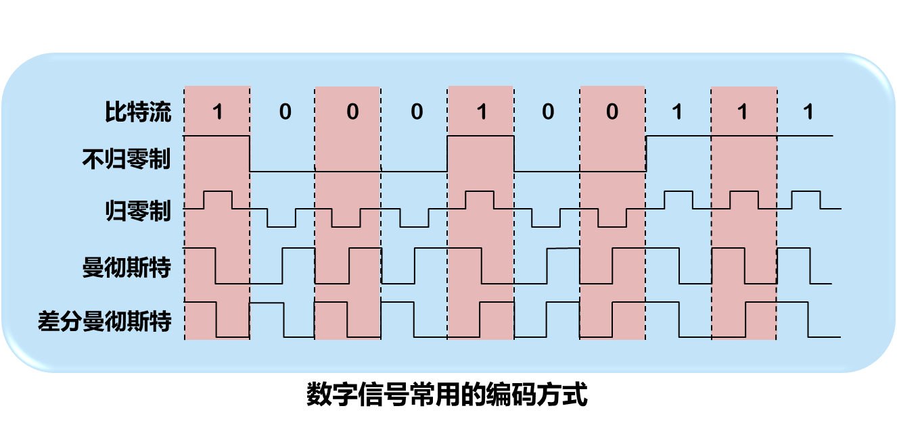

- 不归零制：1上0下
- 归零制：凸为1，凹为0
- 曼切斯特：中心下为1，中心上为0
- 差分曼切斯特：边界有跳变为0，边界无跳变为1

曼切斯特和差分曼切斯特编码具有**`自同步能力`**

基本的二元制调制方法：

1. 调幅：载波的振幅随基带数字信号而变化。
2. 调频：载波的频率随基带数字信号而变化。
3. 调相：载波的初始相位随基带数字信号而变化。

正交振幅调制：为了达到更高的信息传输速率，必须采用技术上更为复杂的多元的振幅相位混合调制方法。

#### 2.2.3信道的极限容量

限制码元在信道上传输速率的因素：

1. 信道能够通过的频率范围

2. 信噪比

   信道的带宽或信道中的信噪比越大，信息的极限传输速率就越高

如何让传输速率更高？

认识那个每一个码元携带更多比特的信息量。

### 2.3物理层下面的传输媒体

#### 2.3.1导引型传输媒体

1. 双绞线

   无屏蔽双绞线UTP

   屏蔽双绞线STP（当数据传送速率较高时使用）

   **`双绞线标准`**：

   **T5678B线序**水晶头金属片朝上，从左到右：**`白橙--》橙--》白绿--》蓝--》白蓝--》绿--》白棕--》棕`**

   发送数据：**`1   2`**

   接受数据：**`3   6`**

2. 同轴电缆

3. 光缆

   光纤：

   - 多模光纤：橙或灰色

     传输波长：850nm或1310nm

   - 单模光纤：黄或绿色

     传输波长：1310nm或1550nm

### 2.4信道复用技术

#### 2.4.1频分复用，时分复用和统计时分复用

复用是通信技术中的基本概念（允许用户使用一个共享信道进行通信，降低成本，提高利用率）

1. 频分复用（最基础）

2. 时分复用（最基础）

   用户在不同睡觉占用相同的频带宽度

3. 统计时分复用

   为改进的时分复用，能明显地提供信道的利用率。

#### 2.4.2波分复用

**波分复用**就是光的频分复用。

#### 2.4.3码分复用

对应位置相乘为0为**`正交`**

CDMA（2-16）：

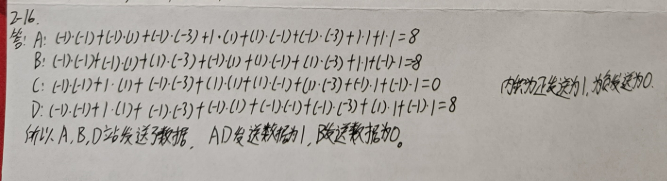

## 第三章 数据链路层

### 3.1数据链路层

#### 3.1.2三个基本问题

**封装成帧，透明传输，`差错检测`**

1. 封装成帧

   在一段数据的前后分别添加首部和尾部，然后就形成了一个帧。

   首部和尾部的一个重要作用就是**帧定界**

   帧<=1500B

2. 透明传输

   "字节填充"法解决透明传输问题

3. **差错检测**

   在一段时间内，传输错误的比特占所传输比特总数的比率称为误码率BER

   目前在数据链路层广泛使用**`循环冗余检验CRC`**的检错技术（只能检测不能改正！！！）

   **帧检验序列FCS** ：为了检错而添加的冗余码。

   假设除数为p（x）= x^4 +x+1，即10011= x^4 * 1 + x^3 * 0 + x^2 * 0 + x^1 * 1 + x^0 * 1 (原式中有的乘以1，没有的乘以0)

   ​        发送数据为1101011011，在**被除之前**需要加上4个0，即**除数个数-1的0**

   ​        得到的余数为1110即为**冗余码**

------

### 3.2点对点协议PPP

#### 3.2.1 PPP协议特点

- 简单
- 封装成帧
- 透明性
- 多种网络层协议
- 多种类型链路
- 差错检测

ppp协议组成：

1. 一个将IP数据报封装到串行链路的方法，PPP即支持同步链路，也支持异步链路。
   - **同步传输：以数据帧为单位传输数据（数据帧的大小不固定！）（从同步码中抽取同步信息）**
   - **异步传输：以字符为单位传输数据（以开始与停止码抓住再同步机会）**
2. 链路控制协议
3. 网络控制协议

#### 3.2.3 PPP协议的帧格式

- PPP协议的首部为4个字段，尾部为2个字段
- PPP是面向字节的，所有的PPP帧的长度都是整数字节

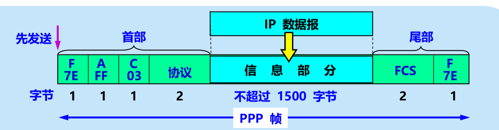

透明传输问题解决方案：
**异步传输：字符填充法**（真正数据：连续7D 5E 改为7E；连续 7D 5D 改为7D）

**同步传输：零比特填充法**（发送端每五个连续1后加0，接收端每五个连续1后删0）

### 3.3使用广播信道的数据链路层

#### 3.3.5以太网的MAC层

MAC：48位   IP：32位

1. MAC层的硬件地址

   硬件地址又称为物理地址或MAC地址

   **48位的MAC地址**

   前24位为**组织唯一标识符**，（IEEE的注册管理机构RA分配）

   后24为为**扩展唯一标识符**，（厂家自行指派）

   

   单播（一对一）

   广播（一对全体）

   多播（一对多）

2. MAC帧的格式

   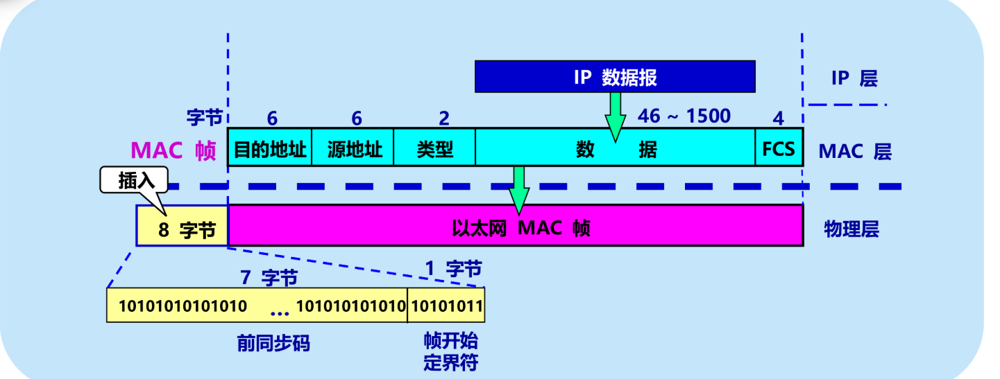

最大MAC帧为1518=1500+6+6+2+4

最小MAC帧为64=46+6+6+2+4

### 3.4扩展的以太网

#### 3.4.2 在数据链路层扩展以太网

交换机

第一个动作为广播，所有端口都知道，后面所有端口都知道第一个发送广播的端口，重复就更新时间

#### 3.4.3虚拟局域网

当数据链路层检测到MAC帧的源地址字段后面的**两个字节的值是0x8100**时，就知道现在插入了**4个字节的VLAN**标签。由于VLAN的以太网帧的首部增加4个字节，因此以太网的最大帧长从原来的1518字节变为了**1522字节**

## 第四章 网络层

### 4.2 网际协议IP

#### 4.2.2  IP地址

IPV4 32，MAC 48，IPV6 128

1. IP地址及其表示方法

   **点分十进制**

   IP地址现在由互联网名字和数字分配机构ICANN

   IP地址：：= {<网络号>，<主机号>}

2. 分类的IP地址

   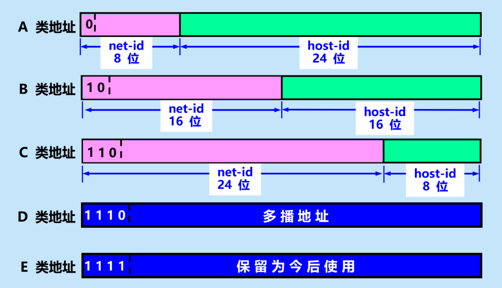

私有IP地址范围：
A：10.0.0.0~10.255.255.255   即10.0.0.0/8

B:  172.16.0.0 ~ 172.31.255.255  即 172.16.0.0/12

C: 192.168.0.0 ~ 192.168.255.255 即 192.168.0.0/16

#### 4.2.4地址解析协议ARP

经过5个路由器主机A-》主机B

6次ARP协议，A--->1--->2--->3--->4--->5--->B

#### 4.2.5 IP数据报格式

- 一个IP数据报由首部和数据两个部分组成。
- 首部的前一部分是固定长度，共**20字节**，是所有IP数据报必须具有的。
- 在首部的固定部分的后面是一些可选字段，其长度是可变的（0~40）

IP数据报首部的固定部分中的各字段

- 首部长度：占4位，四字节为整数倍

- 总长度：首部和数据之和的长度，2^16 - 1 = 65535字节

- 标志：占3位，最低位MF=0没有分片了，MF=1还有分片

  ​                         中间一位DF意思是“不能分片”，只有当DF=0允许分片

- 片偏移：以8个字节为偏移单位

- 首部校验和：占16位，只校验数据报的首部，但不包括数据部分

### 4.3 IP层转发分组的过程

转发表：

转换为二进制，与目标地址的二进制对比，都为1就为1，不同为0，都是0就是0，获得下一跳地址，如果全部都不匹配有默认路由就直接填默认路由。

### 4.5 IPV6

#### 4.5.1 IPV6的基本首部

40字节的基本首部

IPV6的地址是把IPV4的32位扩大了4倍，增加到了128位，地址空间增加了2^96倍

IPV6定义了许多可选的扩展首部，可以提供比IPV4更多的功能，而且还可以提高路由器的处理效率，这是**因为路由器对扩展首部不进行处理（除逐条扩展首部外）**

IPV6首部改为8字节对齐（首部长度必须为8字节的整数倍）（IPV4是4字节对齐）

IPV6数据报由两大部分组成：

1. 基本首部

2. 有效载荷又称净载荷（前面是0~多个扩展首部，后面为数据部分，总长度不超过65535即2^16-1）

   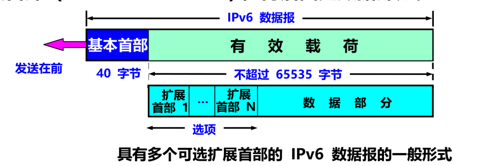

#### 4.5.2 IPV6的地址

IPV6数据报的目的地址可以是以下三种基本类型地址之一：

1. 单播：传统的点对点通信
2. 多播：一点对多点的通信
3. 任播：目标是一组计算机，数据报只交付其中一个（通常是距离最近的一个，**任播IPV6新增**）

IPV6将实现IPV6的主机和路由器均称为结点

一个结点就可能是有多个与链路相连的接口。

IPV6地址是分配给结点上面的接口的。

1. 一个接口可能有多个单播地址。
2. **一个结点接口的单播地址可以用来唯一标志改结点**

IPV6使用**冒号十六进制记法**，允许零压缩：
即：FF05:0:0:0:0:0:0:B3可压缩为：FF05:：B3（注：**任意地址只能压缩一次**）

冒号十六进制记法可结合使用点分十进制记法的后缀：
即0:0:0:0:0:0:128.10.2.1  进行零压缩     ：：128.10.2.1  

IPV6地址分类：
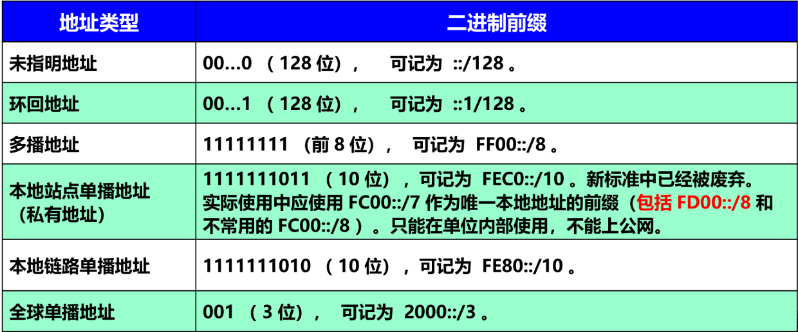

未指名地址：全0，即：：

环回地址：前7位全0最后一位为1，即：：1

常见多播地址（IPV4：224.0.0.1~239.255.255.255）
IPV6   FF00：：/8

#### 4.5.3 从IPV4向IPV6过渡

IPV6系统必须能够接收和转发IPV4分组，并且能够为IPV4分组选择路由。

两种向IPV6过渡的策略：

1. 使用双协议栈
2. 使用隧道技术

#### 4.5.4 ICMPv6

地址解析协议ARP 和 网际组管理协议IGMP 被合并到了ICMPv6

### 4.6互联网的路由选择协议

两大路由选择协议：

- 内部网关协议IGP
  - 在一个自治系统内部使用的路由选择协议
  - 使用的最多的如RIP 和 OSPF
- 外部网关协议EGP
  - 不同自治系统中
  - 使用的最多的是BGP-4

#### 4.6.2 内部网关协议RIP

**通过UDP传输**

RIP协议中的”距离“也称为”跳数“，因为每经过一个路由器，跳数就加1

RIP允许一条路径最多只能包含15个路由器。”距离“的最大值为16时即相当于不可达

**`距离向量算法`**(4-37)：

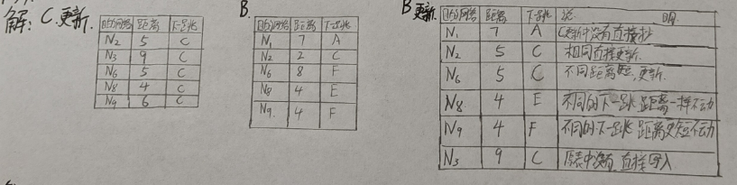

谁发送信息，下一跳地址全部改为谁，距离全部加1，

#### 4.6.3内部网关协议OSPF

通过IP数据报传输

主干区域标识符规定为0.0.0.0

#### 4.6.4外部网关协议 BGP

通过TCP连接

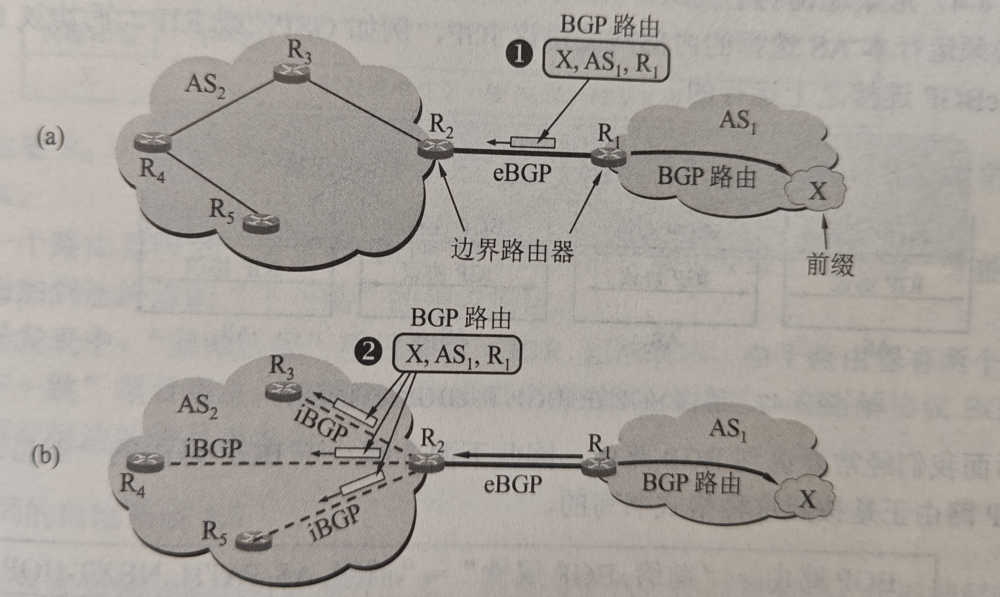

两个不同的AS边界路由器之间的连接称为eBGP

相同自治区之间的路由器称为iBGP

**`BGP路由的选择`**:

- 本地偏好值最高的路由要首先选择
- 选择具有AS跳数最少的路由
- 使用热土豆算法
- 选择路由器BGP标识符的数值最小的路由

#### 4.6.5路由器的构成

交换结构：

1. 通过存储器
2. 通过总线
3. 通过纵横交换结构

### 4.7 IP多播

多播路由选择协议

1. 洪泛和剪除（采用了反向路径广播RPB）
2. 隧道技术
3. 基于核心的发现技术

### 4.9 多协议标签交换MPLS

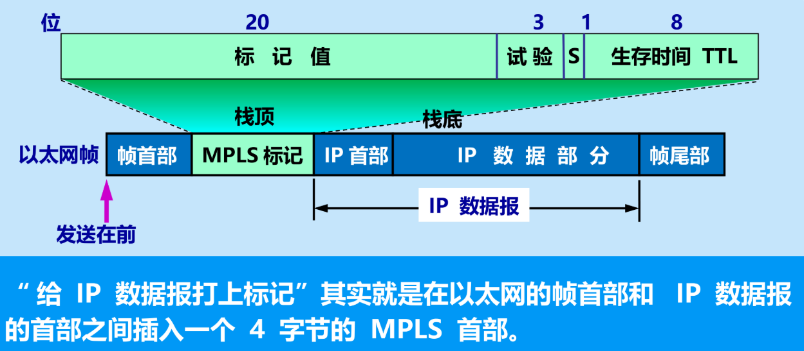

### 4.10软件定义网络SDN简介

OpenFlow（4-66）：

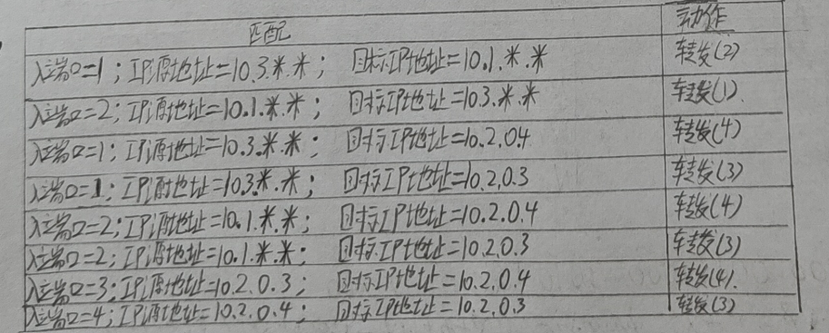
